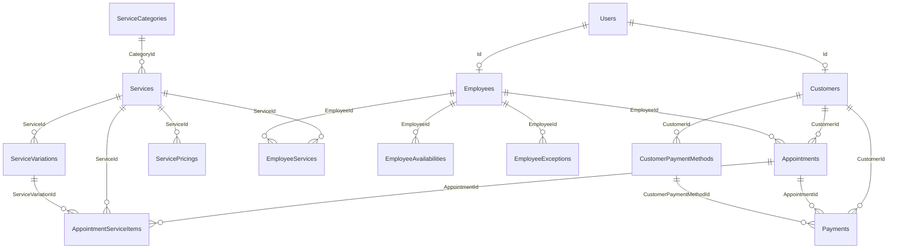
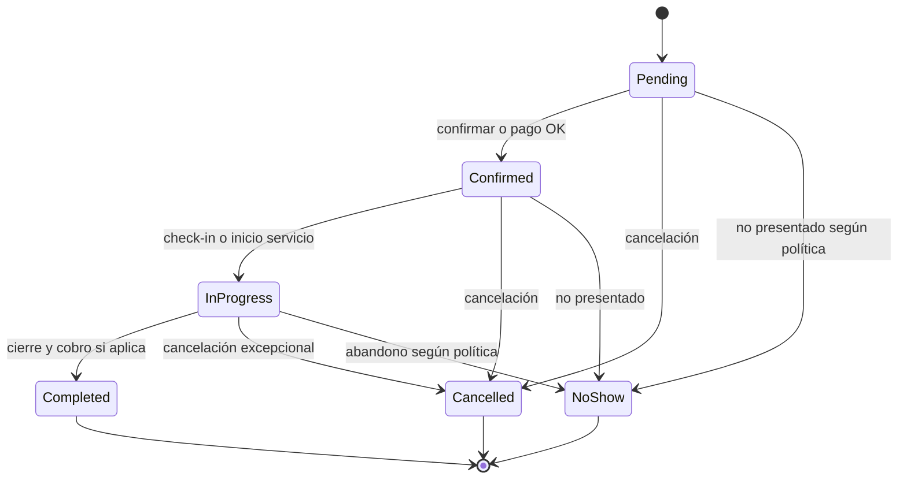

# RESERVARTE — Documentación técnica
## Sistema multi-tenant de gestión para centros de diseño de cejas

**Volumen 1 de 3: Análisis y especificaciones técnicas**

---

**Versión:** 1.0  
**Fecha:** Octubre 2025  
**Cliente:** More Than Brows  
**Ubicación:** España  
**Desarrolladores:** Gabriel Sánchez-Vallejo Millán y Guillermo Algárate del Arco

---

## Índice (volumen 1)

1. [RESUMEN EJECUTIVO](#1-resumen-ejecutivo)
2. [OBJETIVOS DEL PROYECTO](#2-objetivos-del-proyecto)
3. [ALCANCE Y FUNCIONALIDADES](#3-alcance-y-funcionalidades)
4. [ARQUITECTURA TECNOLÓGICA](#4-arquitectura-tecnológica)
5. [ESPECIFICACIONES TÉCNICAS DETALLADAS](#5-especificaciones-técnicas-detalladas)
6. [REQUISITOS LEGALES Y CUMPLIMIENTO NORMATIVO](#6-requisitos-legales-y-cumplimiento-normativo)

---

## 1. RESUMEN EJECUTIVO

### 1.1 Descripción del Proyecto

**ReservArte** es una aplicación web y móvil multi-tenant para la gestión integral de un centro de diseño de cejas. El sistema permite gestionar empleados, clientes, agendas, citas, pagos y recordatorios, con capacidad para operar inicialmente en un solo local y escalar a múltiples locales o reventa como solución SaaS a otros negocios del sector.

### 1.2 Características Principales

- **Arquitectura Multi-Tenant:** Diseñada desde el inicio para soportar múltiples organizaciones
- **Gestión Completa de Citas:** Con asignación de empleados y servicios específicos
- **Sistema de Pagos Avanzado con Redsys:** Pre-autorización para penalización por cancelaciones tardías, guardado seguro de tarjetas
- **Recordatorios Multi-Canal:** Email y WhatsApp configurables
- **Restricciones Configurables:** Control total sobre quién puede reservar y bajo qué condiciones
- **Cumplimiento Legal:** RGPD, LOPD y normativa española de protección de datos

### 1.3 Tecnologías Principales

- **Backend:** ASP.NET Core 8.0 con C#
- **Frontend Web:** Vue 3 con Vite
- **Frontend Móvil:** React Native (iOS y Android)
- **Base de Datos:** Microsoft SQL Server (contenedor Docker)
- **Infraestructura:** Amazon Web Services (AWS)
- **Pasarela de Pago:** Redsys (integración InSite como principal, REST como alternativa)
- **Autenticación y autorización API:** ASP.NET Core Identity (credenciales locales + **login social**); **JWT** (access + refresh) como mecanismo único de autorización en la API; **2FA opcional** (TOTP) para quien la active

---

## 2. OBJETIVOS DEL PROYECTO

### 2.1 Objetivos de Negocio

1. **Digitalizar completamente la gestión** del centro de diseño de cejas
2. **Reducir ausencias y cancelaciones** mediante sistema de pre-autorización de pagos
3. **Mejorar la comunicación con clientes** mediante recordatorios automatizados
4. **Aumentar la eficiencia operativa** con gestión automatizada de citas y empleados
5. **Crear una base para monetización futura** mediante modelo SaaS multi-tenant

### 2.2 Objetivos Técnicos

1. **Alta disponibilidad:** 99.9% uptime objetivo
2. **Escalabilidad:** Soportar desde 1 hasta 100+ organizaciones
3. **Rendimiento:** Tiempos de respuesta < 200ms para operaciones críticas
4. **Seguridad:** Cumplimiento estricto RGPD y PCI-DSS mediante Redsys InSite
5. **Mantenibilidad:** Código limpio, documentado y testeable

### 2.3 Objetivos de Usuario

1. **Cliente Final:**
   - Reservar citas de forma intuitiva en < 2 minutos
   - Recibir recordatorios oportunos y relevantes
   - Gestionar sus citas y perfil fácilmente
   - Guardar tarjetas de forma segura para pagos rápidos

2. **Personal del Centro:**
   - Gestionar agenda de forma eficiente
   - Visualizar información de clientes rápidamente
   - Gestionar servicios y disponibilidad

3. **Administrador:**
   - Control total de configuración
   - Acceso a estadísticas y reportes
   - Gestión de empleados y permisos

---

## 3. ALCANCE Y FUNCIONALIDADES

### 3.1 Módulos del Sistema

#### 3.1.1 Gestión de Organizaciones (Multi-Tenant)

**Prioridad:** MUST-HAVE

**Funcionalidades:**
- Registro y alta de nuevas organizaciones
- Configuración por organización:
  - Datos fiscales y comerciales
  - Horarios de operación
  - Políticas de cancelación personalizadas
  - Branding (logo, colores, dominio personalizado)
- Panel de administración de organizaciones
- Aislamiento total de datos entre organizaciones
- Gestión de suscripciones y facturación (para modelo SaaS)

**Casos de uso:**
1. Dueño de centro registra su negocio en la plataforma
2. Administrador configura horarios y servicios del centro
3. Sistema crea base de datos aislada o schema para la organización

---

#### 3.1.2 Gestión de Empleados

**Prioridad:** MUST-HAVE

**Funcionalidades:**
- CRUD completo de empleados
- Asignación de roles y permisos:
  - Administrador
  - Especialista/Técnico
  - Recepcionista
  - Visualizador (solo lectura)
- Gestión de horarios y disponibilidad:
  - Horarios semanales recurrentes
  - Excepciones (vacaciones, bajas, eventos)
  - Bloques de tiempo no disponibles
- Especialización en servicios:
  - Asignar qué servicios puede realizar cada empleado
  - Niveles de experiencia (junior, senior, experto)
- Comisiones y objetivos de ventas
- Historial de servicios realizados
- Evaluaciones y comentarios de clientes

**Entidades de base de datos:**
```
Employee
- Id (Guid)
- OrganizationId (Guid)
- FirstName (string)
- LastName (string)
- Email (string)
- Phone (string)
- RoleId (Guid)
- IsActive (bool)
- HireDate (DateTime)
- ProfileImageUrl (string)

EmployeeAvailability
- Id (Guid)
- EmployeeId (Guid)
- DayOfWeek (int)
- StartTime (TimeSpan)
- EndTime (TimeSpan)
- IsRecurring (bool)

EmployeeException
- Id (Guid)
- EmployeeId (Guid)
- StartDateTime (DateTime)
- EndDateTime (DateTime)
- Reason (string)
- Type (Vacation/Sick/Other)

EmployeeService
- EmployeeId (Guid)
- ServiceId (Guid)
- ProficiencyLevel (int)
```

---

#### 3.1.3 Gestión de Clientes

**Prioridad:** MUST-HAVE

**Funcionalidades:**
- Registro y perfiles de clientes:
  - Datos personales (nombre, email, teléfono)
  - Preferencias de contacto
  - Historial médico/alergias relevantes
  - Fotografías antes/después (con consentimiento)
- **Gestión de tarjetas de crédito guardadas:**
  - Guardar múltiples tarjetas por cliente mediante tokenización de Redsys
  - Visualizar últimos 4 dígitos y marca de tarjeta
  - Marcar tarjeta por defecto
  - Eliminar tarjetas guardadas
  - Renovación automática de tarjetas caducadas
- Sistema de categorización de clientes:
  - VIP (clientes frecuentes)
  - Regular
  - Nuevo
  - Bloqueado (por no-shows reiterados)
- Control de acceso a reservas:
  - Lista blanca: solo clientes aprobados pueden reservar
  - Restricción por categoría
  - Requerir aprobación manual para nuevos clientes
- Historial completo:
  - Servicios recibidos
  - Empleados que le atendieron
  - Pagos realizados
  - Cancelaciones y no-shows
- Programa de fidelización:
  - Puntos por servicios
  - Descuentos personalizados
  - Cupones y promociones
- Notas internas (solo visibles para el personal)
- Consentimientos y autorizaciones (RGPD)

**Entidades de base de datos:**
```
Customer
- Id (Guid)
- OrganizationId (Guid)
- FirstName (string)
- LastName (string)
- Email (string)
- Phone (string)
- BirthDate (DateTime?)
- CategoryId (Guid)
- LoyaltyPoints (int)
- IsBlocked (bool)
- BlockedReason (string)
- PreferredContactMethod (Email/WhatsApp/SMS)
- MarketingConsent (bool)
- CreatedAt (DateTime)

CustomerNote
- Id (Guid)
- CustomerId (Guid)
- EmployeeId (Guid)
- Note (string)
- CreatedAt (DateTime)

CustomerAllergy
- Id (Guid)
- CustomerId (Guid)
- AllergyDescription (string)
- Severity (Low/Medium/High)

CustomerConsent
- Id (Guid)
- CustomerId (Guid)
- ConsentType (DataProcessing/Marketing/Photos/SavedCards)
- IsGranted (bool)
- GrantedAt (DateTime)
- RevokedAt (DateTime?)

CustomerPaymentMethod
- Id (Guid)
- CustomerId (Guid)
- RedsysToken (string) // Token de Redsys para la tarjeta
- RedsysCofTxnid (string) // ID de transacción original COF
- CardLast4 (string) // Últimos 4 dígitos
- CardBrand (string) // Visa, Mastercard, etc.
- CardExpiry (string) // AAMM
- IsDefault (bool)
- CreatedAt (DateTime)
- UpdatedAt (DateTime)
```

---

#### 3.1.4 Catálogo de Servicios

**Prioridad:** MUST-HAVE

**Funcionalidades:**
- CRUD de servicios:
  - Diseño de cejas
  - Tinte de cejas
- Configuración por servicio:
  - Nombre y descripción
  - Duración estimada
  - Precio base
  - Precio para empleados junior/senior/experto
  - Categoría del servicio
  - Imagen representativa
  - Productos utilizados
  - Requisitos previos (ej: prueba de alergia 48h antes)
- Paquetes y combos:
  - Agrupar múltiples servicios con descuento
  - Servicios secuenciales
- Servicios con variaciones:
  - Tamaño (pequeño/mediano/grande)
  - Técnica (manual/con máquina)
- Disponibilidad temporal:
  - Servicios de temporada
  - Promociones con fecha de inicio/fin

**Entidades de base de datos:**
```
Service
- Id (Guid)
- OrganizationId (Guid)
- Name (string)
- Description (string)
- DurationMinutes (int)
- BasePrice (decimal)
- CategoryId (Guid)
- ImageUrl (string)
- IsActive (bool)
- RequiresAllergyTest (bool)
- AllergyTestHoursBefore (int)

ServiceVariation
- Id (Guid)
- ServiceId (Guid)
- Name (string)
- PriceModifier (decimal)
- DurationModifier (int)

ServicePackage
- Id (Guid)
- OrganizationId (Guid)
- Name (string)
- Description (string)
- TotalPrice (decimal)
- DiscountPercentage (decimal)

ServicePackageItem
- ServicePackageId (Guid)
- ServiceId (Guid)
- Order (int)
```

---

#### 3.1.5 Sistema de Agenda y Citas

**Prioridad:** MUST-HAVE (núcleo del sistema)

**Funcionalidades principales:**

**A. Visualización de Agenda**
- Vista diaria, semanal y mensual
- Vista por empleado individual o todos
- Vista por sala/estación de trabajo
- Código de colores por:
  - Tipo de servicio
  - Estado de la cita (confirmada/pendiente/completada)
  - Cliente VIP
- Drag & drop para reorganizar citas
- Leyenda visual clara

**B. Creación de Citas**
- Dos modos según configuración:
  - **Modo Público:** Clientes pueden reservar directamente
  - **Modo Privado:** Solo personal puede crear citas
- Wizard de reserva paso a paso:
  1. Selección de servicio(s)
  2. Selección de empleado (o automático según disponibilidad)
  3. Selección de fecha y hora
  4. Datos del cliente (o login si ya existe)
  5. **Selección de método de pago (tarjeta guardada o nueva)**
  6. Confirmación y pago
- Validaciones automáticas:
  - Disponibilidad del empleado
  - Tiempo suficiente para el servicio
  - No solapamiento de citas
  - Restricciones del cliente
  - Horarios de operación
- Sugerencias inteligentes:
  - Próximos slots disponibles
  - Empleados alternativos
  - Servicios complementarios

**C. Gestión de Citas**
- Estados de cita (dominio y API; ver **§5.2.2** y máquina de estados):
  - **Pending** — pendiente de confirmación o de pago
  - **Confirmed** — confirmada
  - **InProgress** — en curso (servicio iniciado)
  - **Completed** — completada (terminal)
  - **Cancelled** — cancelada (terminal); en base de datos pueden distinguirse `cancelled`, `cancelled_by_customer`, `cancelled_by_business` según `createDbReservArte.sql`
  - **NoShow** — no presentado (terminal)
- Acciones disponibles:
  - Confirmar/Rechazar
  - Reagendar (automático con notificación)
  - Cancelar (con o sin penalización)
  - Marcar como completada
  - Añadir notas internas
  - Registrar pago
- Notificaciones automáticas en cada cambio de estado

**D. Políticas de Cancelación**
- Configuración por organización:
  - Tiempo mínimo de anticipación para cancelarmodificar sin penalización
  - Porcentaje de penalización (0-100%)
  - Número máximo de no-shows antes de bloqueo
- Sistema de pre-autorización con Redsys:
  - Pre-autorización del importe en tarjeta al reservar
  - Liberación si se cancela con tiempo suficiente
  - Captura del porcentaje penalizado si cancela tarde
  - Captura total en caso de no-show
- Excepciones:
  - Clientes VIP pueden tener políticas diferentes
  - Motivos justificados (emergencias, con evidencia)

**E. Lista de Espera**
- Clientes pueden apuntarse a lista de espera para:
  - Fecha/hora específica si está ocupada
  - Cualquier hueco en un rango de fechas
  - Empleado específico
- Notificación automática cuando se libera un hueco
- Prioridad según:
  - Orden de registro en lista
  - Categoría del cliente (VIP primero)
  - Número de servicios contratados

**Entidades de base de datos:**
```
Appointment
- Id (Guid / INT según esquema)
- OrganizationId (Guid) — en esquema multi-tenant del documento; el script dev `createDbReservArte.sql` aún no incluye organización (single-tenant)
- CustomerId (Guid / INT)
- EmployeeId (Guid / INT)
- AppointmentDate (DateTime)
- StartTime (TimeSpan / TIME)
- EndTime (TimeSpan / TIME)
- Status — ver §5.2.2; CHECK en SQL: `pending`, `confirmed`, `in_progress`, `completed`, `cancelled`, `cancelled_by_customer`, `cancelled_by_business`, `no_show`
- TotalPrice (decimal)
- DepositAmount (decimal)
- RedsysOrderNumber (string) // Número de pedido Redsys
- RedsysPreAuthToken (string) // Token de pre-autorización
- PaymentMethodId (Guid? / INT?) // Tarjeta guardada si aplica
- CancellationReason (string)
- CancelledAt (DateTime?)
- CancelledBy (CustomerId/EmployeeId) — en SQL: `CancelledById`, `CancelledByType`
- Notes (string)
- CreatedAt (DateTime)

AppointmentService (AppointmentServiceItems en SQL)
- Id (Guid)
- AppointmentId (Guid)
- ServiceId (Guid)
- ServiceVariationId (Guid?)
- Price (decimal)
- DurationMinutes (int)
- Order (int)

WaitingList
- Id (Guid)
- OrganizationId (Guid)
- CustomerId (Guid)
- ServiceId (Guid)
- PreferredEmployeeId (Guid?)
- PreferredDate (DateTime?)
- DateRangeStart (DateTime)
- DateRangeEnd (DateTime)
- Priority (int)
- CreatedAt (DateTime)
- NotifiedAt (DateTime?)
```

---

#### 3.1.6 Sistema de Pagos

**Prioridad:** MUST-HAVE (crítico)

**Funcionalidades:**

**A. Métodos de Pago Aceptados**
- Tarjeta de crédito/débito (a través de Redsys)
- Bizum (integración con Redsys)
- Efectivo (registro manual por el personal)
- Transferencia bancaria
- TPV físico (registro en sistema)

**B. Pre-autorización de Pagos con Redsys**
- Al crear la cita online:
  1. Cliente introduce datos de tarjeta (o selecciona tarjeta guardada)
  2. Sistema hace pre-autorización (tipo transacción "1") del 100% o monto configurado
  3. El dinero se bloquea pero NO se cobra
  4. Pre-autorización válida por 7 días
- Escenarios:
  - **Asiste a la cita:** Se confirma (tipo "2") el pago completo al finalizar servicio
  - **Asiste a la cita y paga en efectivo en el local:** Se confirma (tipo "2") el pago completo al finalizar servicio
  - **Cancela con > 24h (o tiempo configurado):** Se cancela (tipo "9") la pre-autorización completa
  - **Cancela con < 24h:** Se confirma el % de penalización configurado
  - **No se presenta (no-show):** Se confirma el 100% del importe

**C. Procesamiento de Pagos con Redsys**
- **Integración InSite (Principal):**
  - Campos de pago en iframes hospedados por Redsys
  - Datos de tarjeta nunca tocan servidor del comercio
  - PCI-DSS SAQ A-EP (requisitos mínimos)
  - SDK JavaScript de Redsys: `https://sis.redsys.es/sis/NC/redsysV3.js`
  - Flujo: Captura en frontend → idOper → Confirmación REST desde backend

- **Integración REST (Alternativa):**
  - Para casos que requieran mayor control
  - Endpoint: `https://sis.redsys.es/sis/rest/trataPeticionREST`
  - PCI-DSS SAQ D (compliance completo requerido)
  - Manejo directo de datos de tarjeta

- **Tokenización de tarjetas:**
  - Parámetro `DS_MERCHANT_IDENTIFIER: "REQUIRED"` en primera transacción
  - `DS_MERCHANT_COF_INI: "S"` para indicar credential-on-file
  - `DS_MERCHANT_COF_TYPE: "R"` para recurrente
  - Almacenar token devuelto (`Ds_Merchant_Identifier`)
  - Usar token en transacciones subsiguientes sin re-introducir tarjeta

- Webhooks/Notificaciones asíncronas:
  - URL de notificación en `DS_MERCHANT_MERCHANTURL`
  - Validación de firma HMAC SHA-256
  - Actualización de estado en base de datos

- Registro de todas las transacciones:
  - Importe, fecha, método
  - Estado (pending/authorized/captured/failed/refunded)
  - Logs de eventos de pasarela
  - Respuestas de Redsys

**D. Facturación**

**⚠️ FUNCIONALIDAD MARCADA COMO FUTURO**

- Generación automática de facturas (FASE FUTURA)
- Formato PDF con diseño personalizado (FASE FUTURA)
- Numeración secuencial por organización (FASE FUTURA)
- Envío automático por email (FASE FUTURA)
- Descarga desde perfil de cliente (FASE FUTURA)
- Integración con contabilidad (FASE FUTURA)

**E. Gestión Financiera**

**⚠️ FUNCIONALIDAD MARCADA COMO FUTURO**

- Dashboard con métricas (FASE FUTURA)
- Reportes exportables (Excel/PDF) (FASE FUTURA)
- Gestión de descuentos y cupones (FASE FUTURA)

**Entidades de base de datos:**
```
Payment
- Id (Guid)
- OrganizationId (Guid)
- AppointmentId (Guid?)
- CustomerId (Guid)
- Amount (decimal)
- Currency (string) // EUR
- PaymentMethod (Card/Cash/Transfer/Bizum)
- Status (Pending/Authorized/Captured/Failed/Refunded/PartiallyRefunded)
- RedsysOrderNumber (string) // Número de pedido único
- RedsysAuthCode (string) // Código de autorización
- RedsysResponse (string) // Código de respuesta (0000-0099 éxito)
- RedsysTransactionType (string) // 0=Auth, 1=PreAuth, 2=Confirm, 9=Cancel
- RedsysCardNumber (string) // PAN enmascarado
- PaymentMethodId (Guid?) // Referencia a tarjeta guardada si aplica
- ProcessedAt (DateTime?)
- RefundedAmount (decimal)
- RefundedAt (DateTime?)
- CreatedAt (DateTime)
- Metadata (jsonb) // Datos adicionales de Redsys
```

---

#### 3.1.7 Sistema de Recordatorios

**Prioridad:** MUST-HAVE (crítico para reducir no-shows)

**Funcionalidades:**

**A. Configuración de Recordatorios**
- Por organización, configurar:
  - Cantidad de recordatorios (ej: 2 recordatorios)
  - Tiempos antes de la cita (ej: 24h y 2h antes)
  - Canales de comunicación (Email, WhatsApp, ambos)
  - Contenido del mensaje (plantillas personalizables)
  - Horarios de envío (no enviar de noche)
- Plantillas con variables dinámicas:
  - Nombre del cliente
  - Fecha y hora de cita
  - Nombre del servicio
  - Nombre del empleado
  - Dirección del local
  - Botón de confirmación/cancelación
  - Instrucciones previas (ej: no usar cremas 24h antes)

**B. Recordatorios por Email**
- Servicio de email transaccional: Amazon SES
- Características:
  - HTML responsive
  - Plain text alternativo
  - Branding personalizado
  - Links de confirmación/cancelación con un click
  - Añadir al calendario (iCal/Google Calendar)
- Tracking:
  - Enviado exitosamente
  - Entregado
  - Abierto (open rate)
  - Click en links
  - Rebotado (bounce)

**C. Recordatorios por WhatsApp**
- Integración con WhatsApp Business API
- Proveedor: Meta (Facebook) + BSP (Business Solution Provider)
- Consideraciones:
  - Cliente debe haber dado opt-in (consentimiento)
  - Usar plantillas aprobadas por Meta
  - Categoría: "Utilidad" (más económica, ~€0.01 por mensaje en España)
  - Respuesta dentro de 24h es gratuita para el negocio
- Contenido del mensaje:
  - Texto con variables (nombre, fecha, hora)
  - Botones de acción (confirmar/cancelar/reagendar)
  - Link a WhatsApp Web para conversación directa
- Costos:
  - ~€0.01 por recordatorio en España (categoría Utilidad)
  - Estimado para 100 citas/mes con 2 recordatorios = €2/mes

**D. Confirmación de Asistencia**
- Cliente puede confirmar asistencia desde:
  - Link en email
  - Botón en WhatsApp
  - Aplicación móvil
- Al confirmar:
  - Actualiza estado de cita
  - Notifica al personal
  - Reduce prioridad en lista de recordatorios

**E. Gestión de Opt-In/Opt-Out**
- Cliente puede elegir:
  - Recibir o no recordatorios
  - Canal preferido (email/whatsapp)
  - Desactivar temporalmente
- Gestión de lista de supresión (bounces, quejas)
- Cumplimiento RGPD: consentimiento explícito

**Entidades de base de datos:**
```
ReminderConfiguration
- Id (Guid)
- OrganizationId (Guid)
- ReminderOrder (int) // 1º, 2º, 3º recordatorio
- HoursBeforeAppointment (int)
- Channel (Email/WhatsApp/Both)
- IsActive (bool)
- MessageTemplateId (Guid)

MessageTemplate
- Id (Guid)
- OrganizationId (Guid)
- Name (string)
- Type (EmailReminder/WhatsAppReminder/Confirmation)
- Subject (string) // solo email
- Body (string) // con variables {{customerName}}, {{appointmentDate}}
- Language (string) // es-ES

ReminderLog
- Id (Guid)
- AppointmentId (Guid)
- ReminderConfigurationId (Guid)
- Channel (Email/WhatsApp)
- SentAt (DateTime)
- Status (Sent/Delivered/Failed/Opened/Clicked)
- ExternalMessageId (string) // ID de SES o WhatsApp
- ErrorMessage (string?)
```

---

#### 3.1.8 Historial y Fotografías

**Prioridad:** SHOULD-HAVE

**Funcionalidades:**
- Subida de fotografías antes/después del servicio
- Almacenamiento en **Cloudinary** (imágenes, transformaciones y CDN)
- Organización por cliente y fecha
- Comparación lado a lado
- Galería privada (solo cliente y personal)
- Opción de compartir en redes (con consentimiento)
- Marca de agua con logo del negocio
- Expiración automática según RGPD (ej: 2 años)

**Entidades de base de datos:**
```
ServicePhoto
- Id (Guid)
- AppointmentId (Guid)
- Type (Before/After)
- CloudinaryPublicId (string) // identificador del recurso en Cloudinary
- CloudinarySecureUrl (string) // URL HTTPS entregada por Cloudinary (o URL firmada si aplica)
- UploadedBy (Guid) // EmployeeId
- UploadedAt (DateTime)
- IsPublic (bool)
- ExpiresAt (DateTime)
```

---

#### 3.1.9 Gestión de Productos

**⚠️ FUNCIONALIDAD COMPLETA MARCADA COMO FUTURO**

**Prioridad:** NICE-TO-HAVE (FASE FUTURA)

**Funcionalidades (FUTURO):**
- Catálogo de productos de venta (FASE FUTURA)
- Inventario (FASE FUTURA)
- Venta en el local (FASE FUTURA)
- E-commerce básico (FASE FUTURA)

**Entidades de base de datos:**
```
Product (FUTURO)
- Id (Guid)
- OrganizationId (Guid)
- Name (string)
- Description (string)
- SKU (string)
- Price (decimal)
- Stock (int)
- MinStockAlert (int)
- ImageUrl (string)
- IsActive (bool)

InventoryMovement (FUTURO)
- Id (Guid)
- ProductId (Guid)
- Quantity (int)
- MovementType (Purchase/Sale/Adjustment/Waste)
- Notes (string)
- CreatedAt (DateTime)
```

---

#### 3.1.10 Reportes y Analíticas

**⚠️ FUNCIONALIDAD COMPLETA MARCADA COMO FUTURO**

**Prioridad:** SHOULD-HAVE (FASE FUTURA)

**Funcionalidades (FUTURO):**
- Dashboard ejecutivo (FASE FUTURA)
- Reportes operativos (FASE FUTURA)
- Reportes financieros (FASE FUTURA)
- Reportes de marketing (FASE FUTURA)
- Exportación a Excel/PDF (FASE FUTURA)

---

#### 3.1.11 Aplicación Móvil

**Prioridad:** MUST-HAVE (Fase 2)

**Funcionalidades para Clientes:**
- Login/registro
- Buscar centros cercanos (si multi-tenant público)
- Ver catálogo de servicios
- Reservar citas
- Ver historial de citas
- Gestionar perfil y preferencias
- **Gestionar tarjetas de crédito guardadas**
- Ver fotografías antes/después
- Recibir notificaciones push
- Programa de fidelización
- Valorar servicios recibidos

**Funcionalidades para Personal:**
- Login con credenciales de empleado
- Ver agenda del día
- Recibir notificaciones de nuevas citas
- Confirmar/cancelar citas
- Registrar llegada del cliente (check-in)
- Marcar servicio como completado
- Ver perfil de cliente
- Registrar pagos en efectivo

**Tecnología:**
- React Native para iOS y Android
- Single codebase
- Notificaciones push: Firebase Cloud Messaging
- Sincronización en tiempo real con backend

---

## 4. ARQUITECTURA TECNOLÓGICA

### 4.1 Stack Tecnológico Seleccionado

#### 4.1.1 Backend

**Framework:** ASP.NET Core 8.0 (LTS)
- **Lenguaje:** C# 12
- **Patrón arquitectónico:** Clean Architecture / Onion Architecture
- **API:** RESTful con ASP.NET Core Web API
- **ORM:** Entity Framework Core 8.0
- **Autenticación / autorización API:** ASP.NET Core Identity (credenciales locales y **login social**: **Google**, **Apple** (Sign in with Apple), **Instagram** vía **OAuth 2.0 de Meta**); **emisión de JWT** (Bearer); **2FA opcional** (TOTP / autenticador), no obligatoria; autorización con `[Authorize]`, roles y políticas sobre el token validado por `JwtBearer`
- **Validación:** FluentValidation
- **Logging:** Serilog con sinks a AWS CloudWatch
- **Testing:** xUnit, Moq, FluentAssertions

**Librerías principales:**
```xml
<PackageReference Include="Microsoft.EntityFrameworkCore" Version="8.0" />
<PackageReference Include="Microsoft.EntityFrameworkCore.SqlServer" Version="8.0" />
<PackageReference Include="Microsoft.AspNetCore.Authentication.JwtBearer" Version="8.0" />
<PackageReference Include="Microsoft.AspNetCore.Authentication.Google" Version="8.0" />
<PackageReference Include="Microsoft.AspNetCore.Authentication.Facebook" Version="8.0" />
<!-- Instagram «Login»: OAuth de Meta; usar Facebook auth handler con app y permisos válidos en Meta Developers -->
<PackageReference Include="AspNet.Security.OAuth.Apple" Version="8.0.0" />
<!-- Sign in with Apple; comprobar versión publicada compatible con el SDK de .NET del proyecto -->
<PackageReference Include="RedsysTPV.NetStandard" Version="3.1.0" />
<PackageReference Include="CloudinaryDotNet" Version="1.26" />
<PackageReference Include="AWSSDK.SimpleEmail" Version="3.7" />
<PackageReference Include="Serilog.Sinks.AWSCloudWatch" Version="5.0" />
<PackageReference Include="FluentValidation.AspNetCore" Version="11.3" />
<PackageReference Include="Swashbuckle.AspNetCore" Version="6.5" />
<PackageReference Include="Hangfire.AspNetCore" Version="1.8" />
<PackageReference Include="MediatR" Version="12.0" />
```

**Estructura del proyecto:**
```
src/
├── ReservArte.API/              # API Controllers, Middleware
├── ReservArte.Application/      # Use Cases, DTOs, Interfaces
├── ReservArte.Domain/           # Entities, Value Objects, Aggregates
├── ReservArte.Infrastructure/   # Data Access, External Services
└── ReservArte.Shared/           # Common utilities, Constants

tests/
├── ReservArte.UnitTests/
├── ReservArte.IntegrationTests/
└── ReservArte.E2ETests/
```

---

#### 4.1.2 Frontend Web

**Framework:** Vue 3 + Vite
- **Lenguaje:** TypeScript 5.3
- **Build Tool:** Vite 5.0 (Hot Module Replacement ultra-rápido)
- **Gestión de estado:** Pinia
- **UI Framework:** Tailwind CSS + componentes headless (p. ej. Radix-Vue, Reka UI) o librería equivalente alineada con Vue
- **Formularios:** VeeValidate + Zod (o validación con Zod únicamente en capa de esquemas)
- **Peticiones HTTP:** Axios o TanStack Query (Vue Query)
- **Calendario:** FullCalendar (integración Vue) o alternativa compatible con Vue 3
- **Gestión de fechas:** date-fns o Day.js
- **Enrutamiento:** Vue Router 4
- **Autenticación:** Composables y guards de ruta con **JWT**; flujo **login social** (Google, Apple, Instagram/Meta) mediante redirección al backend (challenge/callback) y recepción del **mismo par** access/refresh que en el login local; pantalla o ruta para **código 2FA** cuando el usuario tenga TOTP activo

**Razones para elegir Vite (con Vue 3) frente a un framework full-stack tipo Next/Nuxt para esta SPA:**
- **Rendimiento desarrollo:** HMR instantáneo, arranque en milisegundos
- **Simplicidad:** SPA clara con Vue Router, sin capa de servidor obligatoria en el front
- **Flexibilidad:** Control total sobre bundling y optimización
- **Tamaño bundle:** Tree-shaking eficiente
- **Costo:** Stack open-source
- **DevEx:** Buen encaje con el ecosistema Vue 3 (Composition API, `<script setup>`)

**Configuración de Vite (vite.config.ts):**
```typescript
import { defineConfig } from 'vite'
import vue from '@vitejs/plugin-vue'
import path from 'path'

export default defineConfig({
  plugins: [vue()],
  resolve: {
    alias: {
      '@': path.resolve(__dirname, './src'),
    },
  },
  server: {
    port: 3000,
    proxy: {
      '/api': {
        target: 'http://localhost:5000',
        changeOrigin: true,
      },
    },
  },
  build: {
    outDir: 'dist',
    sourcemap: true,
    rollupOptions: {
      output: {
        manualChunks: {
          vendor: ['vue', 'vue-router', 'pinia'],
        },
      },
    },
  },
})
```

**Estructura del proyecto:**
```
frontend-web/
├── src/
│   ├── components/
│   │   ├── ui/                # Componentes básicos
│   │   ├── features/          # Componentes por feature
│   │   └── layouts/           # Layouts
│   ├── lib/
│   │   ├── api/               # Cliente API
│   │   ├── composables/       # Composables reutilizables
│   │   └── utils/             # Utilidades
│   ├── stores/                # Estado global (Pinia)
│   ├── types/                 # TypeScript types
│   ├── App.vue                # Componente raíz
│   └── main.ts                # Entry point
├── public/                    # Assets estáticos
├── index.html                 # HTML template
├── vite.config.ts             # Configuración Vite
└── package.json
```

**Script de inicio:**
```json
{
  "scripts": {
    "dev": "vite",
    "build": "vue-tsc -b && vite build",
    "preview": "vite preview",
    "lint": "eslint . --ext .vue,.ts --report-unused-disable-directives --max-warnings 0"
  }
}
```

---

#### 4.1.3 Frontend Móvil

**Framework:** React Native 0.73
- **Lenguaje:** TypeScript 5.3
- **Navegación:** React Navigation 6
- **Gestión de estado:** Zustand
- **UI Framework:** React Native Paper o NativeBase
- **Notificaciones:** React Native Firebase
- **Gestión de fechas:** date-fns
- **HTTP:** Axios
- **Almacenamiento local:** AsyncStorage o MMKV

---

#### 4.1.4 Base de Datos

**RDBMS:** Microsoft SQL Server (imagen oficial en **Docker**)
- **Despliegue:** Contenedor Docker (p. ej. `mcr.microsoft.com/mssql/server`) en desarrollo y, según entorno, en servidores propios, VMs o orquestación (Docker Compose / Kubernetes / ECS) en preproducción y producción
- **Características utilizadas:**
  - Almacenamiento JSON (`NVARCHAR(MAX)` con `ISJSON` / tipo `JSON` en SQL Server 2022+)
  - Row-Level Security (RLS) o filtros en aplicación (EF Core) para multi-tenancy
  - Índices y búsqueda full-text según necesidades
  - Particionamiento de tablas por `OrganizationId` donde aporte beneficio
  - Copias de seguridad: planes nativos de SQL Server o snapshots del volumen del contenedor según política de recuperación

**Schema Multi-Tenant:**
- **Enfoque inicial:** Shared Database + Shared Schema con `OrganizationId` en todas las tablas
- **Ventajas:**
  - Menor costo inicial
  - Más fácil de gestionar
  - Ideal para pequeña/mediana escala
- **Escalabilidad futura:** Migrar a Database-per-Tenant para clientes Enterprise

---

### 4.2 Infraestructura AWS

#### 4.2.1 Servicios AWS Utilizados

**Compute:**
- **AWS Elastic Beanstalk**: Deployment simplificado de ASP.NET Core
  - O alternativamente: **Amazon ECS Fargate** para containers
- **AWS Lambda**: Funciones serverless para tareas asíncronas (envío de emails, jobs auxiliares); las **imágenes** se gestionan en **Cloudinary** (subida, transformaciones, CDN)

**Storage:**
- **SQL Server en Docker**: Base de datos principal (contenedor con volumen persistente)
  - Dimensionamiento inicial orientativo: 2 vCPU, 4 GB RAM para el host del contenedor
  - Alta disponibilidad: réplicas Always On, segundo nodo o servicio gestionado externo según decisión de despliegue (fuera del alcance del único contenedor de desarrollo)
- **Cloudinary**: Almacenamiento y distribución de **medios** (imágenes)
  - Fotografías de clientes (antes/después, con consentimiento)
  - Logos y assets de branding de organizaciones
  - Transformaciones on-the-fly (tamaño, formato, marca de agua vía URL o API)
  - Entrega por HTTPS / CDN incluido en el servicio
- **Backups de datos**: copias de seguridad de la base de datos y de configuración según política de infraestructura (volúmenes, snapshots, u otro destino acordado; **no** dependen de Cloudinary)

**Networking:**
- **Application Load Balancer (ALB)**: Distribución de tráfico
- **Amazon CloudFront**: CDN para contenido estático de Vite
- **Amazon Route 53**: DNS y dominios personalizados

**Seguridad:**
- **AWS Secrets Manager**: Almacenamiento de secrets (API keys, DB credentials, Redsys keys, **credenciales Cloudinary**)
- **AWS Certificate Manager (ACM)**: Certificados SSL/TLS gratuitos
- **AWS WAF**: Firewall de aplicaciones web

**Monitoring:**
- **Amazon CloudWatch**: Logs, métricas y alarmas
- **AWS X-Ray**: Tracing distribuido

**Email:**
- **Amazon SES**: Envío de emails transaccionales
  - Costo: $0.10 por 1,000 emails
  - Alta deliverability

**Messaging:**
- **Amazon SNS**: Notificaciones y pub/sub
- **Amazon SQS**: Colas para procesamiento asíncrono

---

#### 4.2.2 Diagrama de Arquitectura AWS

```
Internet
    |
    v
[Route 53] ──> [CloudFront CDN] ──> [S3 - Vite Build]
    |
    v
[Application Load Balancer]
    |
    +──────────────────────┬──────────────────────+
    v                      v                      v
[ECS Fargate]        [ECS Fargate]        [ECS Fargate]
.NET API Container   .NET API Container   .NET API Container
    |                      |                      |
    +──────────────────────+──────────────────────+
                           |
         ┌─────────────────┼─────────────────┐
         v                 v                 v
 [SQL Server Docker]  [Cloudinary]   [Secrets Manager]
                           |           (Redsys Keys)
         ┌─────────────────┼─────────────────┐
         v                 v                 v
    [SES Email]      [Lambda Functions]  [CloudWatch]
                           |
                           v
                    [WhatsApp BSP API]
                           |
                           v
                    [Redsys TPV Virtual]
```

> **Nota:** La ruta **CloudFront → S3** se refiere al **despliegue del build estático** del frontend (Vite). Las **imágenes de negocio** (fotos de clientes, logos subidos por organizaciones) se almacenan en **Cloudinary**, no en ese bucket.

---

### 4.3 Multi-Tenant Architecture

#### 4.3.1 Patrón Seleccionado: Shared Database + Shared Schema

**Implementación:**

1. **Aislamiento de datos:**
   - Todas las tablas incluyen columna `OrganizationId`
   - Filtros globales en Entity Framework:
   ```csharp
   protected override void OnModelCreating(ModelBuilder modelBuilder)
   {
       modelBuilder.Entity<Appointment>()
           .HasQueryFilter(a => a.OrganizationId == _currentOrganizationId);
   }
   ```

2. **Identificación de tenant:**
   - Desde subdomain: `organizacion.reservarte.com`
   - O desde header HTTP: `X-Organization-Id`
   - O desde JWT claim: `organization_id`

3. **Middleware de resolución de tenant:**
   ```csharp
   public class TenantMiddleware
   {
       public async Task InvokeAsync(HttpContext context)
       {
           var subdomain = ExtractSubdomain(context.Request.Host);
           var organizationId = await _resolver.ResolveOrganizationId(subdomain);
           _tenantService.SetCurrentTenant(organizationId);
           await _next(context);
       }
   }
   ```

4. **Índices compuestos:**
   ```sql
   CREATE INDEX idx_appointments_org_date 
   ON appointments (organization_id, appointment_date);
   ```

---

#### 4.3.2 Escalabilidad: Plan de Migración Futuro

Para organizaciones grandes (>5000 citas/mes):
- **Migrar a Database-per-Tenant**
- **Sharding horizontal** por región geográfica
- **Leer réplicas** para reportes

---

### 4.4 Seguridad

#### 4.4.1 Autenticación y Autorización

**Principio:** Toda petición autenticada a la API lleva un **JWT de acceso** válido en `Authorization: Bearer <token>`. La **autorización** (roles, políticas, multi-tenant) se resuelve a partir de los **claims** de ese JWT tras la validación `JwtBearer`, no a partir de la sesión del proveedor social.

**Proveedores de login social acordados:**
- **Google:** OpenID Connect / OAuth 2.0 estándar.
- **Apple:** Sign in with Apple (OIDC/OAuth; requisitos de Apple Developer; en web y en apps nativas con flujos que cumplan sus directrices).
- **Instagram:** no expone un «Sign in» genérico independiente como Google; se implementa mediante **plataforma Meta** (OAuth 2.0, típicamente **Facebook Login** / producto **Instagram** en [Meta Developers](https://developers.facebook.com/), permisos y revisión de app según políticas vigentes). El valor `LoginProvider` en `AspNetUserLogins` puede mapearse a `Instagram` o `Facebook` según convención del proyecto, manteniendo un único flujo de emisión de JWT.

**Flujo local (email / contraseña):**
1. `POST /api/v1/auth/login` con credenciales
2. Validación con ASP.NET Core Identity
3. Si el usuario tiene **2FA activada** (opcional, no global), la API responde con un estado intermedio (p. ej. `mfa_required` + **token de un solo uso** de corta duración o cookie efímera) y **no** emite aún el JWT completo hasta verificar el segundo factor
4. `POST /api/v1/auth/mfa/verify` con código TOTP (o código de recuperación válido)
5. Tras éxito: emisión de **access JWT** + **refresh token** (persistido y revocable, mismo modelo que en el resto del documento)
6. Si el usuario **no** tiene 2FA: tras el paso 2 se emiten directamente access JWT + refresh (como hasta ahora)
7. El cliente almacena los tokens según la política de seguridad elegida (p. ej. cookies httpOnly o almacenamiento controlado en SPA)
8. Cada request API envía `Authorization: Bearer <access_token>`; renovación vía `POST /api/v1/auth/refresh-token`

**Flujo social (OAuth 2.0 / OpenID Connect donde aplique):**
1. El usuario inicia el login en **Google**, **Apple** o **Instagram (Meta)**; el **backend** gestiona el intercambio de código / validación del token (flujo con **state** y, donde aplique, **PKCE**) para evitar CSRF y fijación de sesión.
2. Tras validar al sujeto en el IdP, el backend localiza o crea el usuario en Identity, registra el vínculo en **`AspNetUserLogins`** (o equivalente) y aplica reglas de negocio para **cuentas duplicadas** (p. ej. mismo email: vincular proveedor a usuario existente o flujo de verificación explícita).
3. Si el usuario tiene **2FA activada**, aplicar el mismo paso intermedio que en el flujo local (verificación TOTP / recuperación) **antes** de emitir JWT.
4. Se emite el **mismo** access JWT + refresh que sin 2FA o tras superar el segundo factor (mismos claims y caducidades, mismo `JwtTokenService`).
5. Los usuarios **solo sociales** pueden no tener contraseña local; «Olvidé mi contraseña» y cambio de contraseña aplican cuando exista credencial local o tras un alta explícita de contraseña.

**Doble factor de autenticación (2FA), opcional por usuario:**
- **No es obligatorio** a nivel producto ni por rol; cada usuario puede activarlo o desactivarlo desde **ajustes de seguridad de cuenta** (tras estar autenticado).
- Método previsto: **TOTP** (Google Authenticator, Authy, etc.) con secreto almacenado de forma segura en Identity (`AuthenticatorKey` / tabla de tokens de usuario).
- **Códigos de recuperación** de un solo uso (opcional pero recomendable) para pérdida del dispositivo.
- Desactivación de 2FA puede exigir contraseña local o reautenticación reciente según política definida en implementación.

**Claims típicos del access JWT (alineado con la implementación de referencia):**
- `sub`: identificador de usuario
- `email` (u otros claims estándar acordados)
- `organization_id`
- Rol(es) / permisos (p. ej. `ClaimTypes.Role` o políticas derivadas)
- `jti` u otro identificador para trazabilidad o revocación
- Opcional: indicador de que la sesión completó 2FA (p. ej. claim `amr` o `mfa_completed`) si se desea reforzar políticas en endpoints sensibles

**Endpoints REST adicionales (orientativos):**
```
GET    /api/v1/auth/external/{provider}/challenge   # inicia OAuth/OIDC (redirección 302 al IdP)
GET    /api/v1/auth/external/callback               # URI registrada en la consola del proveedor
POST   /api/v1/auth/mfa/verify                        # código TOTP o recuperación tras login parcial
GET    /api/v1/account/mfa/status                     # si 2FA está activa (usuario autenticado)
POST   /api/v1/account/mfa/enable                     # iniciar alta: secreto / URI otpauth
POST   /api/v1/account/mfa/confirm                    # confirmar con primer código TOTP
POST   /api/v1/account/mfa/disable                    # desactivar (con reautenticación según política)
POST   /api/v1/account/mfa/recovery-codes/regenerate  # opcional
```
Los nombres exactos pueden ajustarse al enrutamiento del proyecto; lo esencial es **un solo emisor de JWT** tras cualquier método de entrada.

> **Diferencia con OAuth2 «para terceros»:** En fases posteriores puede existir **OAuth 2.0 / client credentials** u otros flujos para **aplicaciones integradoras** (marketplace, API pública). Ese ámbito autoriza **clientes de API**, no sustituye el **login social de usuarios** humanos descrito aquí.

**Autorización por roles:**
- Admin: acceso total
- Manager: gestión de empleados, servicios, configuración
- Employee: solo sus citas y clientes
- Customer: solo sus datos

**Implementación:**
```csharp
[Authorize(Roles = "Admin,Manager")]
public async Task<IActionResult> GetOrganizationSettings() { ... }

[Authorize(Policy = "CanManageAppointments")]
public async Task<IActionResult> CancelAppointment() { ... }
```

---

#### 4.4.2 Cifrado y Protección de Datos

**En tránsito:**
- TLS 1.3 obligatorio
- HSTS (HTTP Strict Transport Security)
- Certificate Pinning en apps móviles

**En reposo:**
- Cifrado en volumen/host para datos de SQL Server (BitLocker, LUKS, cifrado EBS, etc.) y buenas prácticas TDE si se habilita en la edición correspondiente
- **Cloudinary**: entrega por HTTPS; uso de URLs firmadas o restricciones de acceso según diseño; credenciales (`CloudName`, `ApiKey`, `ApiSecret`) en Secrets Manager
- Secrets Manager para API keys y Redsys credentials

**Datos sensibles:**
- Contraseñas locales: hash seguro (p. ej. algoritmo de Identity / PBKDF2) cuando exista `password_hash`; usuarios solo sociales pueden no tener contraseña local
- Datos de pago: Tokenizados por Redsys, nunca almacenados directamente
- PII: tokenización cuando sea posible

---

#### 4.4.3 Protección contra Ataques

**SQL Injection:**
- Entity Framework con queries parametrizadas
- Validación estricta de inputs

**XSS (Cross-Site Scripting):**
- Vue escapa por defecto el contenido en plantillas; evitar `v-html` con datos no confiables
- Content Security Policy headers

**CSRF (Cross-Site Request Forgery):**
- SameSite cookies
- Anti-forgery tokens en formularios
- En login social: parámetro **`state`** (y PKCE cuando el proveedor lo exija) en el flujo OIDC

**DDoS:**
- AWS WAF con rate limiting
- CloudFront con Shield Standard

**Brute Force:**
- Rate limiting en login (10 intentos / hora)
- Rate limiting en **`/api/v1/auth/mfa/verify`** (límites estrictos por IP y por usuario)
- CAPTCHA después de 3 intentos fallidos
- Bloqueo temporal de cuenta

---

## 5. ESPECIFICACIONES TÉCNICAS DETALLADAS

### 5.1 API RESTful

**Convenciones:**
- **URL:** `/api/v1/{resource}`
- **Versionado:** en URL (`/v1/`)
- **Formato:** JSON
- **Códigos HTTP estándar** (clase de resultado a nivel transporte; el detalle operativo va en el cuerpo, ver §5.1.1)

#### 5.1.1 Contrato de respuesta — envelope JSON

Todas las respuestas con cuerpo JSON de la API pública **ReservArte** deben usar el **mismo envelope** antes de implementar el primer endpoint de negocio, para que frontend (Vue, React Native) y backend (.NET) compartan una única forma de interpretar éxito, datos, errores y metadatos.

**Excepciones explícitas (sin envelope):**
- **Webhooks** que exigen cuerpo firmado o formato propio (p. ej. notificaciones Redsys): se documentan aparte; la respuesta HTTP puede ser mínima o según especificación de la pasarela.
- **Health checks** (`/health`, `/ready`): pueden devolver texto plano o JSON reducido sin envelope, si se declara en OpenAPI.

**Estructura del envelope:**

| Campo | Tipo | Obligatorio | Descripción |
|--------|------|-------------|-------------|
| `success` | `boolean` | Sí | `true` si la operación solicitada se completó según contrato del endpoint. |
| `data` | `object` \| `array` \| `null` | Sí | Payload de negocio en éxito; en error suele ser `null` salvo que el endpoint documente datos parciales (p. ej. conflictos). |
| `error` | `object` \| `null` | Sí | Si `success === false`, objeto de error; si éxito, `null`. |
| `meta` | `object` \| `null` | Sí | Metadatos transversales; si no aplican, `null` o objeto vacío según convención del equipo (recomendado: siempre objeto para facilitar evolución). |

**Objeto `error` (cuando `success === false`):**

| Campo | Tipo | Descripción |
|--------|------|-------------|
| `code` | `string` | **Código de error de aplicación** (catálogo §5.1.2). Estable para ramificar en cliente; **no** confundir con el código HTTP. |
| `message` | `string` | Mensaje legible (puede internacionalizarse en el futuro según `Accept-Language`). |
| `details` | `object` \| `array` \| `null` | Opcional: lista de errores de validación por campo, códigos de pasarela, etc. |

**Objeto `meta` (recomendado):**

| Campo | Tipo | Descripción |
|--------|------|-------------|
| `requestId` | `string` | Identificador único de la petición (correlación logs / soporte). |
| `timestamp` | `string` | ISO-8601 UTC. |
| `version` | `string` | Versión de API expuesta (p. ej. `v1`). |
| `pagination` | `object` | Solo en listas paginadas: `page`, `pageSize`, `totalCount`, `totalPages`. |

**Reglas:**
- **HTTP y envelope:** el código HTTP indica la **clase** de resultado (2xx éxito, 4xx error cliente, 5xx error servidor). Con `success === false`, el cliente debe leer siempre `error.code` (y opcionalmente `details`), no depender solo del texto de `message`.
- **ASP.NET Core:** si interesa `ProblemDetails` u otros tipos internos, un **filtro de resultados** o middleware debe **serializar** siempre al envelope público; no mezclar respuestas crudas con el contrato del cliente.
- **Validación:** usar `error.code = GEN_VALIDATION_FAILED` y en `details` un arreglo de `{ "field": "email", "code": "...", "message": "..." }` (convención a fijar en OpenAPI).
- **Autenticación en dos pasos (2FA):** respuesta HTTP **200** con `success: true` y `data` que incluya un discriminador (p. ej. `authStep: "mfa_required"`, `mfaTicket`) **o** documentar explícitamente otro contrato; no mezclar con `GEN_UNAUTHORIZED` salvo decisión explícita.
- **Paginación:** resultados en `data` (p. ej. `{ "items": [...] }`) y totales en `meta.pagination`.

**Ejemplo — éxito**

```json
{
  "success": true,
  "data": { "id": "...", "name": "..." },
  "error": null,
  "meta": { "requestId": "req_8f2a", "timestamp": "2026-05-07T12:00:00Z", "version": "v1" }
}
```

**Ejemplo — error de negocio**

```json
{
  "success": false,
  "data": null,
  "error": {
    "code": "APT_SLOT_UNAVAILABLE",
    "message": "El horario seleccionado ya no está disponible.",
    "details": null
  },
  "meta": { "requestId": "req_8f2b", "timestamp": "2026-05-07T12:00:01Z", "version": "v1" }
}
```

#### 5.1.2 Catálogo de códigos de error de aplicación (`error.code`)

Prefijo por dominio; códigos en **MAYÚSCULAS_SNAKE_CASE**. La lista es **extensible**: nuevos códigos se añaden aquí y en OpenAPI antes de usar en producción.

| Código | HTTP típico | Uso |
|--------|-------------|-----|
| `GEN_INTERNAL_ERROR` | 500 | Error no esperado; no filtrar detalles internos al cliente en producción. |
| `GEN_NOT_FOUND` | 404 | Recurso inexistente o no visible para el tenant/usuario. |
| `GEN_UNAUTHORIZED` | 401 | Sin autenticación o token inválido/expirado. |
| `GEN_FORBIDDEN` | 403 | Autenticado pero sin permiso o política. |
| `GEN_CONFLICT` | 409 | Conflicto genérico (versión, duplicado) si no aplica un código más específico. |
| `GEN_VALIDATION_FAILED` | 400 | Entrada inválida; usar `error.details` por campo. |
| `GEN_RATE_LIMITED` | 429 | Límite de peticiones excedido. |
| `AUTH_INVALID_CREDENTIALS` | 401 | Login rechazado (credenciales incorrectas). |
| `AUTH_REFRESH_INVALID` | 401 | Refresh token inválido o revocado. |
| `AUTH_MFA_INVALID` | 400 | Código TOTP o recuperación incorrecto. |
| `ORG_TENANT_NOT_RESOLVED` | 400 | No se resolvió organización (subdominio / cabecera). |
| `APT_INVALID_STATE` | 409 | Transición de estado de cita no permitida (ver §5.2.2). |
| `APT_SLOT_UNAVAILABLE` | 409 | Hueco no disponible u overlap. |
| `PAY_REDSYS_DECLINED` | 402 o 422 | Pasarela rechaza operación; opcionalmente en `details` código Redsys (sin datos sensibles PCI). |
| `CUST_BLOCKED` | 403 | Cliente bloqueado para reservar. |

> **Fragmentos de código en §5.3 y en el volumen 2** que devuelven `new { success = false, error = "..." }` son **ilustrativos**: en implementación deben sustituirse por el envelope completo con `error.code` del catálogo y `meta.requestId`.

**Endpoints principales:**

```
# Autenticación
POST   /api/v1/auth/register
POST   /api/v1/auth/login
POST   /api/v1/auth/refresh-token
POST   /api/v1/auth/forgot-password
GET    /api/v1/auth/external/{provider}/challenge   # provider: google | apple | instagram (Meta)
GET    /api/v1/auth/external/callback
POST   /api/v1/auth/mfa/verify
GET    /api/v1/account/mfa/status
POST   /api/v1/account/mfa/enable
POST   /api/v1/account/mfa/confirm
POST   /api/v1/account/mfa/disable
POST   /api/v1/account/mfa/recovery-codes/regenerate

# Organizaciones
GET    /api/v1/organizations/{id}
PUT    /api/v1/organizations/{id}
PATCH  /api/v1/organizations/{id}/settings

# Empleados
GET    /api/v1/employees
GET    /api/v1/employees/{id}
POST   /api/v1/employees
PUT    /api/v1/employees/{id}
DELETE /api/v1/employees/{id}
GET    /api/v1/employees/{id}/availability
PUT    /api/v1/employees/{id}/availability

# Clientes
GET    /api/v1/customers
GET    /api/v1/customers/{id}
POST   /api/v1/customers
PUT    /api/v1/customers/{id}
GET    /api/v1/customers/{id}/history
POST   /api/v1/customers/{id}/notes
GET    /api/v1/customers/{id}/payment-methods
POST   /api/v1/customers/{id}/payment-methods
DELETE /api/v1/customers/{id}/payment-methods/{paymentMethodId}

# Servicios
GET    /api/v1/services
GET    /api/v1/services/{id}
POST   /api/v1/services
PUT    /api/v1/services/{id}

# Citas
GET    /api/v1/appointments
GET    /api/v1/appointments/{id}
POST   /api/v1/appointments
PUT    /api/v1/appointments/{id}
DELETE /api/v1/appointments/{id}
POST   /api/v1/appointments/{id}/confirm
POST   /api/v1/appointments/{id}/cancel
GET    /api/v1/appointments/availability

# Pagos con Redsys
POST   /api/v1/payments/redsys/insite/init
POST   /api/v1/payments/redsys/pre-authorize
POST   /api/v1/payments/redsys/capture
POST   /api/v1/payments/redsys/cancel
POST   /api/v1/payments/redsys/webhook
GET    /api/v1/payments/{id}

# Recordatorios (solo admin)
GET    /api/v1/reminders/configuration
PUT    /api/v1/reminders/configuration
GET    /api/v1/reminders/logs
```

#### 5.1.3 Configuración del backend: `appsettings`, secretos y entornos

La configuración del API ASP.NET Core sigue una **jerarquía fija**; los valores reales sensibles **nunca** se commitean. El fichero base actúa como **contrato** (todas las claves visibles, agrupadas por dominio).

**Orden de precedencia (el último gana):**

1. **`appsettings.json`** — **en el repositorio.** Contiene **todas** las secciones y claves con valores vacíos `""`, `0`, `false` o placeholders no secretos (`"CHANGE_ME"`). Sirve de inventario y documentación viva: cualquier desarrollador ve qué debe existir. Incluye comentarios **solo si el proyecto usa JSON con comentarios** (p. ej. `//` admitido por el pipeline); si se exige JSON estricto, duplicar la explicación en este volumen o en `user-secrets-guide.md` por sección.
2. **`appsettings.Development.json`** — **en el repositorio.** Solo valores **no sensibles** de desarrollo: URLs `localhost`, orígenes CORS locales, flags de features de dev, **`MultiTenant:ResolutionStrategy = "Header"`** (y `HeaderName`, p. ej. `X-Organization-Id`) para **no depender de subdominios** en local. No almacenar secretos aquí.
3. **`appsettings.Production.json`** — **en el repositorio.** Únicamente claves **no sensibles** de producción: URLs públicas de la API, nombres de recursos AWS (sin ARNs con secretos), flags estables, timeouts. Los secretos se resuelven en niveles 4–5.
4. **User Secrets** (`dotnet user-secrets`) — **solo máquina del desarrollador; nunca en el repo.** Todos los secretos locales: cadena SQL si contiene contraseña, `Jwt:SecretKey`, claves OAuth, `Cloudinary:ApiSecret`, claves de firma Redsys de test, credenciales SES de sandbox, etc.
5. **Variables de entorno / AWS Secrets Manager** — **producción (y CI staging).** Sustituyen o complementan User Secrets; convención `Section__Key` para variables de entorno en ASP.NET Core. Redsys por organización y otros secretos multi-tenant deben leerse desde **Secrets Manager** (o tabla cifrada + KMS) según diseño ya alineado con el volumen 2.

**Documento de onboarding:** `Documentation/Project-Init/user-secrets-guide.md` (se creará manualmente). Debe incluir:
- Comandos `dotnet user-secrets init` y `dotnet user-secrets set "<Clave>" "<Valor>"` **por cada secreto** alineado con el esquema siguiente (misma ruta `Section:Subsection:Key` que en configuración).
- **Tarjetas y escenarios de prueba Redsys** (entorno de pruebas del banco / documentación oficial): operación OK, denegada, SCA/3DS si aplica; advertencia de no usar PAN reales.
- Uso de **ngrok** (u homólogo) para exponer `https://...` hacia la API local y registrar esa URL en la configuración del comercio Redsys para **probar el webhook** `POST .../payments/redsys/webhook`.
- **FAQ:** resolución de tenant por cabecera en dev, rotación de JWT, diferencia entre clave Redsys global vs por `OrganizationId`, errores típicos de firma HMAC, cómo comprobar que User Secrets están cargados (`UserSecretsId` en el `.csproj`).

---

**Esquema lógico de `appsettings.json` (contrato — valores vacíos en repo)**

| Sección | Claves principales | Dónde obtener el valor real | Sensibilidad |
|--------|---------------------|-----------------------------|--------------|
| **ConnectionStrings** | `DefaultConnection` | Cadena SQL Server (Docker local / RDS). | Secreto si incluye password → User Secrets / Secrets Manager / env. |
| **Jwt** | `Issuer`, `Audience`, `SecretKey`, `AccessTokenMinutes`, `RefreshTokenDays` | `SecretKey`: aleatorio fuerte (≥ 32 bytes). Issuer/Audience: URLs o identificadores de la API. | `SecretKey` siempre secreto. |
| **Authentication:Google** | `ClientId`, `ClientSecret` | Consola Google Cloud / OAuth. | Secreto. |
| **Authentication:Apple** | `ClientId`, `TeamId`, `KeyId`, `PrivateKey` (o ruta) | Apple Developer / Sign in with Apple. | Secreto (clave privada). |
| **Authentication:Meta** | `AppId`, `AppSecret` | Meta Developers (Instagram Login). | Secreto. |
| **MultiTenant** | `ResolutionStrategy` (`Subdomain` \| `Header`), `HeaderName`, `BaseDomain` (prod), `DefaultOrganizationId` (solo dev opcional) | Producto: en prod suele ser subdominio; en dev **Header** (ver `appsettings.Development.json`). | No secreto salvo IDs de prueba opcionales. |
| **Cors** | `AllowedOrigins` (array) | Orígenes del front (Vite dev, staging, prod). | No secreto. |
| **Cloudinary** | `CloudName`, `ApiKey`, `ApiSecret` | Dashboard Cloudinary. | `ApiSecret` secreto. |
| **Aws:Ses** (o **Email:Ses**) | `Region`, `FromAddress`, `FromName`, `AccessKey`, `SecretKey` (si no se usa rol IAM en ECS) | AWS SES; en ECS preferir **rol de tarea** sin claves en fichero. | Claves IAM secretas si aplica. |
| **Email** | `Provider`, `DefaultFrom` | Alineado con SES u otro proveedor. | Depende. |
| **Hangfire** | `DashboardPath`, `Storage:Provider`, `Storage:ConnectionString` (o usar `DefaultConnection`), `WorkerCount`, `Queues` | Hangfire + SQL Server. | ConnectionString puede ser secreto. |
| **Redsys** | `WebhookBaseUrl` (URL pública de la API para validaciones internas), `DefaultEnvironment` (`test`/`production`), `SecretsProvider` (`UserSecrets`/`SecretsManager`), prefijo o patrón para claves por organización | FUC/Terminal en BD por organización; **clave de firma** por org en Secrets Manager (coherente con código tipo `Redsys:{organizationId}:SecretKey`). | Claves de firma siempre secretas. |
| **DataProtection** | `ApplicationName`, `KeyRing` (ruta o blob) | Claves de cifrado de cookies/DataProtection en farm. | Secreto / almacén seguro en prod. |
| **Encryption** | `AppDataKey` (opcional, para campos cifrados en aplicación) | Generar y rotar según política. | Secreto. |
| **IpRateLimiting** | Alineado con **§4.4** / volumen 2 (`EnableEndpointRateLimiting`, reglas por endpoint) | Umbrales operativos. | No secreto. |
| **FeatureFlags** | `EnablePublicBooking`, `EnableWhatsAppReminders`, `EnableSavedCards`, etc. | Producto / operaciones. | No secreto. |
| **GdprRetention** | `CustomerDataRetentionDays`, `LogRetentionDays`, `AnonymizeAfterCancelledDays`, `ExportDeadlineHours` | Legal / DPO; coherente con políticas descritas en **§6**. | No secreto; revisión legal. |

**Ejemplo de esqueleto JSON (contrato; valores ilustrativos vacíos o neutros)**

```json
{
  "ConnectionStrings": {
    "DefaultConnection": ""
  },
  "Jwt": {
    "Issuer": "",
    "Audience": "",
    "SecretKey": "",
    "AccessTokenMinutes": 0,
    "RefreshTokenDays": 0
  },
  "Authentication": {
    "Google": { "ClientId": "", "ClientSecret": "" },
    "Apple": { "ClientId": "", "TeamId": "", "KeyId": "", "PrivateKey": "" },
    "Meta": { "AppId": "", "AppSecret": "" }
  },
  "MultiTenant": {
    "ResolutionStrategy": "",
    "HeaderName": "",
    "BaseDomain": "",
    "DefaultOrganizationId": ""
  },
  "Cors": {
    "AllowedOrigins": []
  },
  "Cloudinary": {
    "CloudName": "",
    "ApiKey": "",
    "ApiSecret": ""
  },
  "Aws": {
    "Ses": {
      "Region": "",
      "FromAddress": "",
      "FromName": "",
      "AccessKey": "",
      "SecretKey": ""
    }
  },
  "Hangfire": {
    "DashboardPath": "",
    "WorkerCount": 0,
    "Storage": {
      "Provider": "",
      "ConnectionString": ""
    }
  },
  "Redsys": {
    "WebhookBaseUrl": "",
    "DefaultEnvironment": "",
    "SecretsProvider": "",
    "SecretKeyPathPattern": ""
  },
  "DataProtection": {
    "ApplicationName": "",
    "KeyRing": ""
  },
  "Encryption": {
    "AppDataKey": ""
  },
  "IpRateLimiting": {
    "EnableEndpointRateLimiting": false
  },
  "FeatureFlags": {
    "EnablePublicBooking": false,
    "EnableWhatsAppReminders": false,
    "EnableSavedCards": false
  },
  "GdprRetention": {
    "CustomerDataRetentionDays": 0,
    "LogRetentionDays": 0,
    "AnonymizeAfterCancelledDays": 0,
    "ExportDeadlineHours": 0
  }
}
```

**`appsettings.Development.json` (orientación, sin secretos)**  
- `MultiTenant:ResolutionStrategy` = `"Header"` y `HeaderName` acordado (p. ej. `X-Organization-Id`) para pruebas con Postman/Thunder Client.  
- `Cors:AllowedOrigins` = `http://localhost:3000`, etc.  
- `Jwt:AccessTokenMinutes` puede ser más largo en dev si el equipo lo acuerda (documentar en guía).  
- Opcional: `Redsys:DefaultEnvironment` = `test` (no secreto).

**`appsettings.Production.json`**  
- Orígenes CORS definitivos, `Jwt:Issuer`/`Audience` públicos, `MultiTenant:BaseDomain`, `Redsys:WebhookBaseUrl` pública de la API, `Hangfire:DashboardPath` protegido por auth.  
- Sin `SecretKey`, sin `ApiSecret`, sin claves Redsys en claro.

**Coherencia con el resto de la documentación**  
- **Redsys por organización:** FUC/terminal en modelo de datos de organización (volumen 1 §5.2); **material de firma** vía Secrets Manager o patrón documentado en `Redsys:SecretKeyPathPattern` — alineado con fragmentos del volumen 2 que resuelven secreto por `organizationId`.  
- **Cloudinary / SES / Secrets Manager:** coherente con **§4.1** y diagramas AWS.  
- **Rate limiting:** mismas claves que los ejemplos `IpRateLimiting` en volumen 2, integradas en este esquema o en fichero parcial si se prefiere.  
- **OAuth:** mismas rutas `Authentication:*` que **§4.4.1** y volumen 2 (`Program.cs`).  
- **Frontend:** el `.env` de Vite sigue siendo solo cliente; **no** duplica secretos del servidor; esta sección es la fuente para el backend.

> **`ORG_TENANT_NOT_RESOLVED` (catálogo §5.1.2):** con estrategia **Header** en desarrollo, el cliente debe enviar la cabecera configurada; con **Subdomain** en producción, la resolución depende del host. El mismo código de error cubre ambos modos; el mensaje o `details` pueden indicar la estrategia activa para depuración.

---

### 5.2 Base de Datos - Esquema Completo

**Script SQL de referencia (modelo físico actual en SQL Server):** [`Documentation/createDbReservArte.sql`](createDbReservArte.sql) — identificadores `INT IDENTITY`, tabla `Users` compartida por `Customers` y `Employees` (`Id` alineado), catálogo ampliado (productos, paquetes, promociones, etc.). Los diagramas **§5.2.1** y **§5.2.2** se basan en ese fichero.

> **Nota (convivencia con el DDL orientativo multi-tenant):** El bloque SQL más abajo (UUID, `organizations`, …) describe la **visión lógica SaaS** del producto. La implementación debe **converger** ambos modelos (p. ej. añadiendo `OrganizationId` al script, o migrando el DDL del documento al estándar del repositorio). Hasta esa convergencia, **`createDbReservArte.sql`** es la fuente de verdad para relaciones y `CHECK` de estados en entorno dev.

#### 5.2.1 Diagrama entidad-relación (ERD) — `createDbReservArte.sql`

*Vista 1 — núcleo de usuarios, citas, servicios y pagos.*



*Vista 2 — catálogo productos, ventas, recordatorios y auxiliares.*

```mermaid
erDiagram
    ProductCategories ||--o{ Products : "CategoryId"
    Products ||--o{ ServiceProducts : "ProductId"
    Services ||--o{ ServiceProducts : "ServiceId"
    ServicePackages ||--o{ ServicePackageItems : "ServicePackageId"
    Services ||--o{ ServicePackageItems : "ServiceId"
    Services ||--o{ ServicePromotions : "ServiceId"
    ServicePackages ||--o{ ServicePromotions : "ServicePackageId"
    Customers ||--o{ WaitingList : "CustomerId"
    Services ||--o{ WaitingList : "ServiceId"
    Employees ||--o{ WaitingList : "PreferredEmployeeId"
    Customers ||--o{ ProductSales : "CustomerId"
    Appointments ||--o{ ProductSales : "AppointmentId"
    Employees ||--o{ ProductSales : "SoldBy"
    ProductSales ||--o{ ProductSaleItems : "SaleId"
    Products ||--o{ ProductSaleItems : "ProductId"
    Products ||--o{ InventoryMovements : "ProductId"
    Employees ||--o{ InventoryMovements : "CreatedBy"
    Customers ||--o{ CustomerNotes : "CustomerId"
    Employees ||--o{ CustomerNotes : "EmployeeId"
    Customers ||--o{ CustomerAllergies : "CustomerId"
    Customers ||--o{ CustomerConsents : "CustomerId"
    Appointments ||--o{ ServicePhotos : "AppointmentId"
    Employees ||--o{ ServicePhotos : "UploadedBy"
    MessageTemplates ||--o{ ReminderConfigurations : "MessageTemplateId"
    Appointments ||--o{ ReminderLogs : "AppointmentId"
    ReminderConfigurations ||--o{ ReminderLogs : "ReminderConfigurationId"
    Appointments ||--o{ ConfirmationTokens : "AppointmentId"
```



*Tablas sin FK en el script (configuración global):* `CancellationPolicies`, `Configuration`.

#### 5.2.2 Máquina de estados — ciclo de vida de la cita

Referencia para API, UI y reglas de negocio. Los nombres en **PascalCase** corresponden al dominio; el script SQL usa **snake_case** en el `CHECK` de `Appointments.Status`.

**Mapeo dominio ↔ `createDbReservArte.sql`:**

| Dominio (enum / API) | Valor en columna `Status` |
|---------------------|---------------------------|
| Pending | `pending` |
| Confirmed | `confirmed` |
| InProgress | `in_progress` |
| Completed | `completed` |
| Cancelled | `cancelled`, `cancelled_by_customer` o `cancelled_by_business` |
| NoShow | `no_show` |



- **Transiciones prohibidas** por regla de negocio típica: desde **Completed** no se vuelve a estados abiertos (reagendar = nueva cita o flujo explícito en API).
- **Código de ejemplo** en este documento que usa `AppointmentStatus.PaymentFailed` es orientativo: el `CHECK` actual del SQL **no** incluye ese valor; conviene tratar el fallo de pago como **Pending** con metadata o ampliar el esquema de forma explícita.

---

**Tablas principales con cambios para Redsys y tarjetas guardadas:**

> **Nota (SQL Server en Docker):** El DDL siguiente es **orientativo** (sintaxis cercana a PostgreSQL en versiones anteriores del documento). En **Microsoft SQL Server** se traducirá a T-SQL: `UNIQUEIDENTIFIER`, `BIT`, `DATETIME2`, `NVARCHAR(MAX)` para JSON, `NEWID()` / `NEWSEQUENTIALID()`, etc. El despliegue adoptado es **SQL Server en contenedor Docker** con volumen persistente.

```sql
-- Multi-Tenant
CREATE TABLE organizations (
    id UUID PRIMARY KEY DEFAULT gen_random_uuid(),
    name VARCHAR(200) NOT NULL,
    subdomain VARCHAR(50) UNIQUE NOT NULL,
    email VARCHAR(255) NOT NULL,
    phone VARCHAR(20),
    address TEXT,
    city VARCHAR(100),
    postal_code VARCHAR(10),
    country VARCHAR(2) DEFAULT 'ES',
    tax_id VARCHAR(20), -- CIF/NIF
    logo_url TEXT,
    is_active BOOLEAN DEFAULT true,
    subscription_tier VARCHAR(50) DEFAULT 'basic',
    subscription_expires_at TIMESTAMP,
    -- Configuración Redsys
    redsys_merchant_code VARCHAR(20), -- FUC
    redsys_terminal VARCHAR(10),
    redsys_secret_key VARCHAR(255), -- Almacenado en Secrets Manager
    redsys_environment VARCHAR(20) DEFAULT 'test', -- test/production
    created_at TIMESTAMP DEFAULT CURRENT_TIMESTAMP,
    updated_at TIMESTAMP DEFAULT CURRENT_TIMESTAMP
);

-- Configuración
CREATE TABLE organization_settings (
    id UUID PRIMARY KEY DEFAULT gen_random_uuid(),
    organization_id UUID REFERENCES organizations(id) ON DELETE CASCADE,
    public_booking_enabled BOOLEAN DEFAULT true,
    booking_requires_approval BOOLEAN DEFAULT false,
    cancellation_hours_threshold INT DEFAULT 24,
    cancellation_penalty_percentage DECIMAL(5,2) DEFAULT 0.00,
    max_no_shows_before_block INT DEFAULT 3,
    currency VARCHAR(3) DEFAULT 'EUR',
    timezone VARCHAR(50) DEFAULT 'Europe/Madrid',
    -- Configuración pagos
    enable_saved_cards BOOLEAN DEFAULT true,
    enable_bizum BOOLEAN DEFAULT true,
    enable_cash BOOLEAN DEFAULT true,
    settings_json NVARCHAR(MAX), -- JSON (validar con ISJSON en SQL Server)
    created_at TIMESTAMP DEFAULT CURRENT_TIMESTAMP,
    updated_at TIMESTAMP DEFAULT CURRENT_TIMESTAMP
);

-- Usuarios
-- Nota Identity + login social: en el esquema real de ASP.NET Core Identity se usarán AspNetUsers, AspNetUserLogins, etc.
-- password_hash NULL admite cuentas solo sociales; los logins externos se almacenan en AspNetUserLogins (LoginProvider, ProviderKey).
CREATE TABLE users (
    id UUID PRIMARY KEY DEFAULT gen_random_uuid(),
    organization_id UUID REFERENCES organizations(id) ON DELETE CASCADE,
    email VARCHAR(255) UNIQUE NOT NULL,
    password_hash VARCHAR(255), -- NULL si el usuario solo usa proveedor externo
    first_name VARCHAR(100) NOT NULL,
    last_name VARCHAR(100) NOT NULL,
    phone VARCHAR(20),
    role VARCHAR(50) NOT NULL,
    is_active BOOLEAN DEFAULT true,
    email_verified BOOLEAN DEFAULT false,
    email_verification_token VARCHAR(255),
    password_reset_token VARCHAR(255),
    password_reset_expires_at TIMESTAMP,
    last_login_at TIMESTAMP,
    created_at TIMESTAMP DEFAULT CURRENT_TIMESTAMP,
    updated_at TIMESTAMP DEFAULT CURRENT_TIMESTAMP
);

-- Empleados
CREATE TABLE employees (
    id UUID PRIMARY KEY DEFAULT gen_random_uuid(),
    organization_id UUID REFERENCES organizations(id) ON DELETE CASCADE,
    user_id UUID REFERENCES users(id) ON DELETE SET NULL,
    first_name VARCHAR(100) NOT NULL,
    last_name VARCHAR(100) NOT NULL,
    email VARCHAR(255),
    phone VARCHAR(20),
    position VARCHAR(100),
    hire_date DATE,
    is_active BOOLEAN DEFAULT true,
    profile_image_url TEXT,
    bio TEXT,
    commission_percentage DECIMAL(5,2) DEFAULT 0.00,
    created_at TIMESTAMP DEFAULT CURRENT_TIMESTAMP,
    updated_at TIMESTAMP DEFAULT CURRENT_TIMESTAMP
);

-- Clientes
CREATE TABLE customers (
    id UUID PRIMARY KEY DEFAULT gen_random_uuid(),
    organization_id UUID REFERENCES organizations(id) ON DELETE CASCADE,
    user_id UUID REFERENCES users(id) ON DELETE SET NULL,
    first_name VARCHAR(100) NOT NULL,
    last_name VARCHAR(100) NOT NULL,
    email VARCHAR(255),
    phone VARCHAR(20),
    birth_date DATE,
    category VARCHAR(50) DEFAULT 'Regular',
    loyalty_points INT DEFAULT 0,
    is_blocked BOOLEAN DEFAULT false,
    blocked_reason TEXT,
    no_show_count INT DEFAULT 0,
    preferred_contact_method VARCHAR(20) DEFAULT 'Email',
    marketing_consent BOOLEAN DEFAULT false,
    whatsapp_opt_in BOOLEAN DEFAULT false,
    created_at TIMESTAMP DEFAULT CURRENT_TIMESTAMP,
    updated_at TIMESTAMP DEFAULT CURRENT_TIMESTAMP
);

-- *** NUEVA TABLA: Métodos de pago guardados (Tokenización Redsys) ***
CREATE TABLE customer_payment_methods (
    id UUID PRIMARY KEY DEFAULT gen_random_uuid(),
    customer_id UUID REFERENCES customers(id) ON DELETE CASCADE,
    organization_id UUID REFERENCES organizations(id) ON DELETE CASCADE,
    -- Datos de tokenización Redsys
    redsys_token VARCHAR(255) NOT NULL, -- Ds_Merchant_Identifier
    redsys_cof_txnid VARCHAR(255), -- Ds_Merchant_Cof_Txnid
    redsys_card_brand VARCHAR(50), -- Visa, Mastercard, etc.
    redsys_card_last4 VARCHAR(4) NOT NULL, -- Últimos 4 dígitos
    redsys_card_expiry VARCHAR(4), -- AAMM (ej: 3412 = dic 2034)
    redsys_card_number_masked VARCHAR(20), -- 454881******0003
    -- Configuración
    is_default BOOLEAN DEFAULT false,
    nickname VARCHAR(100), -- "Visa personal", "Tarjeta trabajo"
    -- Metadata
    created_at TIMESTAMP DEFAULT CURRENT_TIMESTAMP,
    updated_at TIMESTAMP DEFAULT CURRENT_TIMESTAMP,
    last_used_at TIMESTAMP,
    UNIQUE(customer_id, redsys_token)
);

-- Índice para consultas frecuentes
CREATE INDEX idx_payment_methods_customer 
ON customer_payment_methods(customer_id, is_default);

-- Servicios
CREATE TABLE services (
    id UUID PRIMARY KEY DEFAULT gen_random_uuid(),
    organization_id UUID REFERENCES organizations(id) ON DELETE CASCADE,
    name VARCHAR(200) NOT NULL,
    description TEXT,
    duration_minutes INT NOT NULL,
    base_price DECIMAL(10,2) NOT NULL,
    category VARCHAR(100),
    image_url TEXT,
    is_active BOOLEAN DEFAULT true,
    requires_allergy_test BOOLEAN DEFAULT false,
    allergy_test_hours_before INT,
    created_at TIMESTAMP DEFAULT CURRENT_TIMESTAMP,
    updated_at TIMESTAMP DEFAULT CURRENT_TIMESTAMP
);

-- Citas (actualizada para Redsys)
CREATE TABLE appointments (
    id UUID PRIMARY KEY DEFAULT gen_random_uuid(),
    organization_id UUID REFERENCES organizations(id) ON DELETE CASCADE,
    customer_id UUID REFERENCES customers(id) ON DELETE SET NULL,
    employee_id UUID REFERENCES employees(id) ON DELETE SET NULL,
    appointment_date DATE NOT NULL,
    start_time TIME NOT NULL,
    end_time TIME NOT NULL,
    status VARCHAR(50) NOT NULL DEFAULT 'Pending',
    total_price DECIMAL(10,2) NOT NULL,
    deposit_amount DECIMAL(10,2) DEFAULT 0.00,
    -- Campos Redsys
    redsys_order_number VARCHAR(20) UNIQUE, -- Número de pedido único
    redsys_pre_auth_token VARCHAR(255), -- Token de la pre-autorización
    redsys_auth_code VARCHAR(20), -- Código de autorización
    redsys_transaction_type VARCHAR(5), -- 0,1,2,9
    payment_method_id UUID REFERENCES customer_payment_methods(id), -- Si usó tarjeta guardada
    -- Control de cita
    cancellation_reason TEXT,
    cancelled_at TIMESTAMP,
    cancelled_by UUID,
    notes TEXT,
    created_by UUID,
    created_at TIMESTAMP DEFAULT CURRENT_TIMESTAMP,
    updated_at TIMESTAMP DEFAULT CURRENT_TIMESTAMP
);

-- Pagos (actualizada para Redsys)
CREATE TABLE payments (
    id UUID PRIMARY KEY DEFAULT gen_random_uuid(),
    organization_id UUID REFERENCES organizations(id) ON DELETE CASCADE,
    appointment_id UUID REFERENCES appointments(id) ON DELETE SET NULL,
    customer_id UUID REFERENCES customers(id),
    amount DECIMAL(10,2) NOT NULL,
    currency VARCHAR(3) DEFAULT 'EUR',
    payment_method VARCHAR(50), -- Card, Cash, Transfer, Bizum
    status VARCHAR(50) NOT NULL,
    -- Campos específicos Redsys
    redsys_order_number VARCHAR(20),
    redsys_auth_code VARCHAR(20), -- Ds_AuthorisationCode
    redsys_response_code VARCHAR(10), -- Ds_Response (0000-0099 éxito)
    redsys_transaction_type VARCHAR(5), -- 0=pago, 1=preauth, 2=confirm, 9=cancel
    redsys_card_number_masked VARCHAR(20), -- Ds_Card_Number (454881******0003)
    redsys_card_brand VARCHAR(50), -- Ds_Card_Brand
    redsys_merchant_data TEXT, -- Ds_MerchantData personalizado
    payment_method_id UUID REFERENCES customer_payment_methods(id), -- Si usó tarjeta guardada
    -- Metadata
    processed_at TIMESTAMP,
    refunded_amount DECIMAL(10,2) DEFAULT 0.00,
    refunded_at TIMESTAMP,
    metadata NVARCHAR(MAX), -- JSON completo de respuesta Redsys
    created_at TIMESTAMP DEFAULT CURRENT_TIMESTAMP,
    updated_at TIMESTAMP DEFAULT CURRENT_TIMESTAMP
);

-- Log de eventos Redsys (para auditoría)
CREATE TABLE redsys_transaction_log (
    id UUID PRIMARY KEY DEFAULT gen_random_uuid(),
    organization_id UUID REFERENCES organizations(id) ON DELETE CASCADE,
    appointment_id UUID REFERENCES appointments(id) ON DELETE SET NULL,
    payment_id UUID REFERENCES payments(id) ON DELETE SET NULL,
    redsys_order_number VARCHAR(20) NOT NULL,
    transaction_type VARCHAR(50), -- PreAuth, Capture, Cancel, Refund
    request_params NVARCHAR(MAX), -- Parámetros enviados (JSON)
    response_params NVARCHAR(MAX), -- Respuesta completa de Redsys (JSON)
    response_code VARCHAR(10),
    is_success BOOLEAN,
    error_message TEXT,
    created_at TIMESTAMP DEFAULT CURRENT_TIMESTAMP
);

-- Índices importantes
CREATE INDEX idx_appointments_org_date ON appointments(organization_id, appointment_date);
CREATE INDEX idx_appointments_redsys_order ON appointments(redsys_order_number);
CREATE INDEX idx_payments_redsys_order ON payments(redsys_order_number);
CREATE INDEX idx_payments_appointment ON payments(appointment_id);
CREATE INDEX idx_redsys_log_order ON redsys_transaction_log(redsys_order_number);

-- Resto de tablas (sin cambios significativos)...
-- [employee_availability, employee_exceptions, customer_notes, 
--  customer_allergies, customer_consents, etc.]
```

---

### 5.3 Integración con Pasarelas de Pago - Redsys

> **Desarrollo local (sprint de pagos):** guía práctica con entorno test, **User Secrets**, **ngrok** / túnel para `DS_MERCHANT_MERCHANTURL`, tabla exhaustiva de tarjetas y escenarios, flujo de verificación y errores frecuentes en [`redsys-development-guide.md`](redsys-development-guide.md).

#### 5.3.1 Redsys InSite (Método Principal Recomendado)

**Por qué InSite como método principal:**
- **PCI-DSS simplificado**: SAQ A-EP vs SAQ D completo
- **Seguridad mejorada**: Datos de tarjeta nunca tocan el servidor del comercio
- **Experiencia de usuario**: Pago sin redirección externa
- **Cumplimiento automático**: Redsys maneja 3D Secure 2.x y SCA
- **Costos reducidos**: Auditorías PCI más económicas (~€2k-10k vs €20k-100k+ anuales)

**Flujo InSite para ReservArte:**

```csharp
// 1. Frontend: Incluir SDK de Redsys
// En index.html de Vite:
<script src="https://sis.redsys.es/sis/NC/redsysV3.js"></script>

// 2. Frontend: Inicializar campos de pago
function initRedsysInSiteFields() {
    const merchantCode = '999008881';
    const terminal = '001';
    const orderNumber = generateUniqueOrderNumber();
    
    // Crear contenedores para iframes
    getCardInput('card-number-container', styles, 'Número de tarjeta');
    getExpirationMonthInput('expiry-month-container', styles);
    getExpirationYearInput('expiry-year-container', styles);
    getCVVInput('cvv-container', styles, 'CVV');
    getPayButton('pay-button-container', styles, 'Pagar', 
                 merchantCode, terminal, orderNumber);
}

// 3. Frontend: Capturar idOper cuando el usuario hace click en pagar
inSitePayment.addEventListener('paymentSuccess', function(event) {
    const idOper = event.detail.idOper;
    // Enviar idOper al backend
    fetch('/api/v1/payments/redsys/insite/complete', {
        method: 'POST',
        headers: { 'Content-Type': 'application/json' },
        body: JSON.stringify({
            appointmentId: currentAppointmentId,
            idOper: idOper,
            saveCard: document.getElementById('save-card-checkbox').checked
        })
    });
});
```

```csharp
// 4. Backend C#: Completar pago con idOper
[HttpPost("payments/redsys/insite/complete")]
public async Task<IActionResult> CompleteInSitePayment([FromBody] InSitePaymentRequest request)
{
    var appointment = await _appointmentRepository.GetByIdAsync(request.AppointmentId);
    var organization = await _organizationRepository.GetByIdAsync(appointment.OrganizationId);
    
    // Preparar parámetros para Redsys REST
    var merchantParameters = new Dictionary<string, object>
    {
        { "DS_MERCHANT_ORDER", appointment.RedsysOrderNumber },
        { "DS_MERCHANT_MERCHANTCODE", organization.RedsysMerchantCode },
        { "DS_MERCHANT_TERMINAL", organization.RedsysTerminal },
        { "DS_MERCHANT_TRANSACTIONTYPE", "1" }, // Pre-autorización
        { "DS_MERCHANT_AMOUNT", ((int)(appointment.TotalPrice * 100)).ToString() },
        { "DS_MERCHANT_CURRENCY", "978" }, // EUR
        { "DS_MERCHANT_IDOPER", request.IdOper },
        { "DS_MERCHANT_MERCHANTURL", $"{_baseUrl}/api/v1/payments/redsys/webhook" }
    };
    
    // Si el cliente quiere guardar la tarjeta, añadir tokenización
    if (request.SaveCard)
    {
        merchantParameters.Add("DS_MERCHANT_IDENTIFIER", "REQUIRED");
        merchantParameters.Add("DS_MERCHANT_COF_INI", "S");
        merchantParameters.Add("DS_MERCHANT_COF_TYPE", "R");
    }
    
    // Generar firma HMAC SHA-256
    var paymentRequestService = new PaymentRequestService();
    var signature = GenerateRedsysSignature(merchantParameters, organization.RedsysSecretKey);
    
    // Llamar a Redsys REST API
    var response = await _httpClient.PostAsync(
        "https://sis.redsys.es/sis/rest/trataPeticionREST",
        new StringContent(JsonSerializer.Serialize(new {
            Ds_SignatureVersion = "HMAC_SHA256_V1",
            Ds_MerchantParameters = Convert.ToBase64String(
                Encoding.UTF8.GetBytes(JsonSerializer.Serialize(merchantParameters))
            ),
            Ds_Signature = signature
        }), Encoding.UTF8, "application/json")
    );
    
    var result = await response.Content.ReadFromJsonAsync<RedsysResponse>();
    
    // Procesar respuesta
    if (result.IsSuccess)
    {
        appointment.RedsysPreAuthToken = result.AuthCode;
        appointment.RedsysAuthCode = result.AuthCode;
        appointment.Status = AppointmentStatus.Confirmed;
        
        // Si Redsys devolvió token de tarjeta, guardarlo
        if (request.SaveCard && !string.IsNullOrEmpty(result.Token))
        {
            await SaveCustomerPaymentMethod(appointment.CustomerId, result);
        }
        
        await _appointmentRepository.UpdateAsync(appointment);
        
        return Ok(new { success = true, appointmentId = appointment.Id });
    }
    
    return BadRequest(new { success = false, error = result.ErrorMessage });
}

// Método para guardar tarjeta tokenizada
private async Task SaveCustomerPaymentMethod(Guid customerId, RedsysResponse response)
{
    var paymentMethod = new CustomerPaymentMethod
    {
        CustomerId = customerId,
        OrganizationId = _currentOrganizationId,
        RedsysToken = response.Token, // Ds_Merchant_Identifier
        RedsysCofTxnid = response.CofTxnId, // Ds_Merchant_Cof_Txnid
        RedsysCardBrand = response.CardBrand,
        RedsysCardLast4 = response.CardLast4,
        RedsysCardExpiry = response.CardExpiry, // AAMM
        RedsysCardNumberMasked = response.CardNumberMasked,
        IsDefault = !await _paymentMethodRepository.CustomerHasPaymentMethodsAsync(customerId)
    };
    
    await _paymentMethodRepository.AddAsync(paymentMethod);
}
```

**Ventajas de InSite para ReservArte:**
✅ PCI-DSS SAQ A-EP (requisitos mínimos)  
✅ Datos de tarjeta en iframes de Redsys  
✅ Experiencia sin redirección  
✅ Tokenización integrada para guardar tarjetas  
✅ Costo de compliance reducido  
✅ Implementación más rápida (~1-2 semanas)

---

#### 5.3.2 Redsys REST API (Método Alternativo)

**Cuándo usar REST en lugar de InSite:**
- Necesidad de control total del flujo de pago
- Diseño completamente personalizado imposible con CSS
- Ya existe infraestructura PCI-DSS certificada

**Flujo REST para pre-autorización:**

```csharp
[HttpPost("payments/redsys/pre-authorize")]
public async Task<IActionResult> PreAuthorizePayment([FromBody] PreAuthRequest request)
{
    var appointment = await _appointmentRepository.GetByIdAsync(request.AppointmentId);
    var organization = await _organizationRepository.GetByIdAsync(appointment.OrganizationId);
    
    // Generar número de pedido único
    var orderNumber = GenerateUniqueOrderNumber();
    appointment.RedsysOrderNumber = orderNumber;
    
    var merchantParameters = new Dictionary<string, object>
    {
        { "DS_MERCHANT_ORDER", orderNumber },
        { "DS_MERCHANT_MERCHANTCODE", organization.RedsysMerchantCode },
        { "DS_MERCHANT_TERMINAL", organization.RedsysTerminal },
        { "DS_MERCHANT_TRANSACTIONTYPE", "1" }, // 1 = Pre-autorización
        { "DS_MERCHANT_AMOUNT", ((int)(appointment.TotalPrice * 100)).ToString() },
        { "DS_MERCHANT_CURRENCY", "978" },
        { "DS_MERCHANT_MERCHANTURL", $"{_baseUrl}/api/v1/payments/redsys/webhook" },
        { "DS_MERCHANT_URLOK", $"{_frontendUrl}/payment/success" },
        { "DS_MERCHANT_URLKO", $"{_frontendUrl}/payment/error" }
    };
    
    var signature = GenerateRedsysSignature(merchantParameters, organization.RedsysSecretKey);
    
    // Devolver datos para redirección al TPV de Redsys
    return Ok(new
    {
        actionUrl = "https://sis.redsys.es/sis/realizarPago",
        parameters = new
        {
            Ds_SignatureVersion = "HMAC_SHA256_V1",
            Ds_MerchantParameters = Convert.ToBase64String(
                Encoding.UTF8.GetBytes(JsonSerializer.Serialize(merchantParameters))
            ),
            Ds_Signature = signature
        }
    });
}

// Webhook para notificaciones de Redsys
[HttpPost("payments/redsys/webhook")]
public async Task<IActionResult> RedsysWebhook()
{
    try
    {
        var merchantParameters = Request.Form["Ds_MerchantParameters"].ToString();
        var signature = Request.Form["Ds_Signature"].ToString();
        
        // Validar firma
        var decodedParams = Convert.FromBase64String(merchantParameters);
        var paramsJson = Encoding.UTF8.GetString(decodedParams);
        var response = JsonSerializer.Deserialize<RedsysNotification>(paramsJson);
        
        var organization = await _organizationRepository.GetByMerchantCodeAsync(
            response.Ds_MerchantCode
        );
        
        var calculatedSignature = GenerateRedsysSignature(paramsJson, organization.RedsysSecretKey);
        
        if (signature != calculatedSignature)
        {
            _logger.LogWarning("Firma Redsys inválida");
            return BadRequest("Firma inválida");
        }
        
        // Procesar según código de respuesta
        var appointment = await _appointmentRepository.GetByRedsysOrderAsync(response.Ds_Order);
        
        if (int.TryParse(response.Ds_Response, out int responseCode) && responseCode <= 99)
        {
            // Pre-autorización exitosa
            appointment.RedsysPreAuthToken = response.Ds_AuthorisationCode;
            appointment.Status = AppointmentStatus.Confirmed;
            
            await _appointmentRepository.UpdateAsync(appointment);
            
            // Registrar pago
            await _paymentService.RegisterPreAuthorizationAsync(appointment, response);
            
            _logger.LogInformation($"Pre-autorización exitosa para cita {appointment.Id}");
        }
        else
        {
            // Pre-autorización fallida
            appointment.Status = AppointmentStatus.PaymentFailed;
            await _appointmentRepository.UpdateAsync(appointment);
            
            _logger.LogWarning($"Pre-autorización fallida: {response.Ds_Response}");
        }
        
        return Ok();
    }
    catch (Exception ex)
    {
        _logger.LogError(ex, "Error procesando webhook de Redsys");
        return StatusCode(500);
    }
}

// Confirmar pre-autorización (capturar pago)
[HttpPost("payments/redsys/capture")]
public async Task<IActionResult> CapturePreAuthorization([FromBody] CaptureRequest request)
{
    var appointment = await _appointmentRepository.GetByIdAsync(request.AppointmentId);
    var organization = await _organizationRepository.GetByIdAsync(appointment.OrganizationId);
    
    var merchantParameters = new Dictionary<string, object>
    {
        { "DS_MERCHANT_ORDER", appointment.RedsysOrderNumber },
        { "DS_MERCHANT_MERCHANTCODE", organization.RedsysMerchantCode },
        { "DS_MERCHANT_TERMINAL", organization.RedsysTerminal },
        { "DS_MERCHANT_TRANSACTIONTYPE", "2" }, // 2 = Confirmación
        { "DS_MERCHANT_AMOUNT", ((int)(request.Amount * 100)).ToString() },
        { "DS_MERCHANT_CURRENCY", "978" }
    };
    
    var signature = GenerateRedsysSignature(merchantParameters, organization.RedsysSecretKey);
    
    var response = await _httpClient.PostAsync(
        "https://sis.redsys.es/sis/rest/trataPeticionREST",
        CreateRedsysRequestContent(merchantParameters, signature)
    );
    
    var result = await response.Content.ReadFromJsonAsync<RedsysResponse>();
    
    if (result.ResponseCode == "0900") // Confirmación exitosa
    {
        appointment.Status = AppointmentStatus.Completed;
        await _appointmentRepository.UpdateAsync(appointment);
        
        await _paymentService.RegisterCaptureAsync(appointment, result);
        
        return Ok(new { success = true });
    }
    
    return BadRequest(new { success = false, error = result.ErrorMessage });
}

// Cancelar pre-autorización
[HttpPost("payments/redsys/cancel")]
public async Task<IActionResult> CancelPreAuthorization([FromBody] CancelRequest request)
{
    var appointment = await _appointmentRepository.GetByIdAsync(request.AppointmentId);
    var organization = await _organizationRepository.GetByIdAsync(appointment.OrganizationId);
    
    var merchantParameters = new Dictionary<string, object>
    {
        { "DS_MERCHANT_ORDER", appointment.RedsysOrderNumber },
        { "DS_MERCHANT_MERCHANTCODE", organization.RedsysMerchantCode },
        { "DS_MERCHANT_TERMINAL", organization.RedsysTerminal },
        { "DS_MERCHANT_TRANSACTIONTYPE", "9" }, // 9 = Cancelación
        { "DS_MERCHANT_AMOUNT", ((int)(appointment.TotalPrice * 100)).ToString() },
        { "DS_MERCHANT_CURRENCY", "978" }
    };
    
    var signature = GenerateRedsysSignature(merchantParameters, organization.RedsysSecretKey);
    
    var response = await _httpClient.PostAsync(
        "https://sis.redsys.es/sis/rest/trataPeticionREST",
        CreateRedsysRequestContent(merchantParameters, signature)
    );
    
    var result = await response.Content.ReadFromJsonAsync<RedsysResponse>();
    
    if (result.ResponseCode == "0400") // Cancelación exitosa
    {
        appointment.Status = AppointmentStatus.Cancelled;
        appointment.RedsysPreAuthToken = null;
        await _appointmentRepository.UpdateAsync(appointment);
        
        return Ok(new { success = true });
    }
    
    return BadRequest(new { success = false, error = result.ErrorMessage });
}

// Método auxiliar para generar firma HMAC SHA-256
private string GenerateRedsysSignature(Dictionary<string, object> parameters, string secretKey)
{
    var orderNumber = parameters["DS_MERCHANT_ORDER"].ToString();
    
    // 1. Decodificar la clave secreta de Base64
    var keyBytes = Convert.FromBase64String(secretKey);
    
    // 2. Cifrar el número de pedido con 3DES
    using var des = TripleDES.Create();
    des.Key = keyBytes;
    des.Mode = CipherMode.CBC;
    des.Padding = PaddingMode.Zeros;
    des.IV = new byte[8]; // IV de ceros
    
    var orderBytes = Encoding.UTF8.GetBytes(orderNumber);
    var encryptedOrder = des.CreateEncryptor().TransformFinalBlock(orderBytes, 0, orderBytes.Length);
    
    // 3. Calcular HMAC SHA-256
    using var hmac = new HMACSHA256(encryptedOrder);
    var paramsJson = JsonSerializer.Serialize(parameters);
    var paramsBase64 = Convert.ToBase64String(Encoding.UTF8.GetBytes(paramsJson));
    var signatureBytes = hmac.ComputeHash(Encoding.UTF8.GetBytes(paramsBase64));
    
    // 4. Convertir a Base64
    return Convert.ToBase64String(signatureBytes);
}
```

**Desventajas de REST para ReservArte:**
❌ PCI-DSS SAQ D (compliance completo obligatorio)  
❌ Costos de auditoría elevados (€20k-100k+/año)  
❌ Mayor responsabilidad de seguridad  
❌ Implementación más compleja (~2-4 semanas)  
❌ Mantenimiento continuo de seguridad

---

#### 5.3.3 Costos de Redsys en España

**Estructura de costos:**
- Redsys es un **procesador**, no banco adquirente
- Los comercios contratan a través de su banco
- Costos varían por banco y volumen

**Costos típicos 2025:**
- **Comisión por transacción**: 1.0% - 1.5% (tarjetas ES/UE)
- **Tarjetas internacionales**: 2% - 3%
- **Cuota mensual**: €0 - €50 (según banco)
- **Bizum**: ~€0.50 por transacción
- **Sin costos de setup de Redsys** (puede haber del banco)

**Comparativa:**
| Pasarela | Comisión UE | Comisión No-UE | Cuota Mensual |
|----------|-------------|----------------|---------------|
| **Redsys** | 1.0-1.5% | 2-3% | €0-50 |
| Stripe | 1.4% + €0.25 | 2.9% + €0.25 | €0 |
| PayPal | 2.9% + €0.35 | 3.4% + €0.35 | €0 |

**Redsys es competitivo** especialmente para comercios en España con alto volumen de transacciones nacionales.

---

## 6. REQUISITOS LEGALES Y CUMPLIMIENTO NORMATIVO

### 6.1 RGPD (Reglamento General de Protección de Datos)

#### 6.1.1 Principios a Cumplir

1. **Licitud, lealtad y transparencia**
   - Informar claramente al usuario sobre qué datos se recogen y para qué
   - Política de privacidad accesible y comprensible

2. **Limitación de la finalidad**
   - Datos solo para gestión de citas y servicios
   - Marketing solo con consentimiento explícito separado

3. **Minimización de datos**
   - Solo recoger datos estrictamente necesarios
   - No pedir datos "por si acaso"

4. **Exactitud**
   - Permitir al usuario actualizar sus datos fácilmente
   - Rectificación en < 1 mes

5. **Limitación del plazo de conservación**
   - Clientes inactivos > 2 años: solicitar confirmación o eliminar
   - Fotografías: expiración automática según configuración
   - Tokens de Redsys: conservar mientras la tarjeta esté activa

6. **Integridad y confidencialidad**
   - Cifrado en tránsito (TLS) y en reposo
   - Control de accesos estricto
   - Tokens de Redsys en base de datos cifrada

---

#### 6.1.2 Derechos de los Interesados

La aplicación debe implementar mecanismos para que los usuarios ejerzan sus derechos:

**1. Derecho de Acceso (Art. 15 RGPD)**
- Usuario puede descargar todos sus datos en formato JSON/PDF
- Incluir tokens de tarjetas guardadas (enmascarados)
- Implementar endpoint: `GET /api/v1/customers/me/data-export`

**2. Derecho de Rectificación (Art. 16)**
- Permitir editar perfil en cualquier momento
- Sin restricciones ni demoras

**3. Derecho de Supresión / "Derecho al Olvido" (Art. 17)**
- Botón "Eliminar mi cuenta" en configuración
- Proceso de confirmación (email con link)
- **Eliminar tokens de tarjetas de Redsys**
- Anonimización en lugar de eliminación física (por obligaciones fiscales)
- Eliminar fotografías en **Cloudinary** (p. ej. API `destroy`) y referencias en base de datos

**4. Derecho a la Portabilidad (Art. 20)**
- Exportar datos en formato legible por máquina (JSON)
- Historial de citas, pagos, servicios

**5. Derecho de Oposición (Art. 21)**
- Opt-out de marketing con un click
- Darse de baja de recordatorios

**6. Decisiones Automatizadas (Art. 22)**
- Si se usa IA/ML para decisiones (ej: bloqueo automático por no-shows), explicar la lógica

---

#### 6.1.3 Consentimientos Necesarios

**Implementación de consentimientos:**

```typescript
// Ejemplo de UI de consentimientos al registrarse
interface ConsentCheckboxes {
  dataProcessing: {
    checked: boolean; // OBLIGATORIO
    text: "Acepto el tratamiento de mis datos personales para la gestión de citas";
  };
  marketing: {
    checked: boolean; // OPCIONAL
    text: "Acepto recibir comunicaciones comerciales y promociones";
  };
  photos: {
    checked: boolean; // OPCIONAL
    text: "Autorizo el uso de fotografías de mis servicios con fines internos";
  };
  whatsappNotifications: {
    checked: boolean; // OPCIONAL
    text: "Acepto recibir recordatorios de citas por WhatsApp";
  };
  savedCards: {
    checked: boolean; // OPCIONAL
    text: "Acepto que se guarden los datos tokenizados de mi tarjeta mediante Redsys para pagos futuros";
  };
}
```

**Granularidad:**
- Cada finalidad debe tener su propio checkbox
- No checkboxes pre-marcados (salvo los estrictamente necesarios)
- Permitir revocar consentimientos fácilmente

---

#### 6.1.4 Evaluación de Impacto (EIPD)

**¿Cuándo es obligatoria?**
- Sí, porque se tratan **datos de salud** (alergias, condiciones médicas)
- Sí, porque se usa **perfilado** (categorización de clientes, penalizaciones)
- Sí, porque se guardan **referencias de tarjetas** (aunque tokenizadas)

**Contenido mínimo de la EIPD:**
1. Descripción sistemática del tratamiento
2. Finalidades del tratamiento
3. Evaluación de necesidad y proporcionalidad
4. Evaluación de riesgos para los derechos de los interesados
5. Medidas de mitigación de riesgos

**Responsable:** El cliente (centro de cejas) debe realizar la EIPD con ayuda del Delegado de Protección de Datos (DPO) si corresponde.

---

### 6.2 LOPD y LSSI-CE (España)

#### 6.2.1 Ley Orgánica de Protección de Datos (LOPD)

**Obligaciones específicas en España:**

1. **Inscripción en el Registro de Actividades de Tratamiento**
   - No es obligatorio inscribirse en la AEPD
   - Sí mantener Registro interno de Actividades

2. **Delegado de Protección de Datos (DPO)**
   - Obligatorio si:
     - >250 empleados
     - O tratamiento sistemático y a gran escala de categorías especiales de datos (como datos de salud)
   - Para un centro de cejas pequeño: **probablemente no obligatorio**
   - Para el modelo SaaS con múltiples clientes: **considerar seriamente**

3. **Transferencias Internacionales**
   - AWS tiene centros de datos en EU (Frankfurt, Irlanda)
   - Usar solo regiones EU para cumplir
   - **Redsys es español**: Todos los datos permanecen en España/UE
   - No hay transferencia internacional de datos de pago
   - Ventaja sobre pasarelas USA (Stripe, PayPal) que requieren cláusulas adicionales

---

#### 6.2.2 Ley de Servicios de la Sociedad de la Información (LSSI-CE)

**Obligaciones:**

1. **Información Legal (Aviso Legal)**
   - Identificación completa de la organización
   - Datos fiscales (CIF)
   - Domicilio social
   - Email de contacto
   - Registro Mercantil (si aplica)

2. **Política de Privacidad**
   - Separada del Aviso Legal
   - Detalle de tratamientos, finalidades, plazos
   - Derechos del usuario y cómo ejercerlos
   - **Sección específica sobre guardado de tarjetas con Redsys**

3. **Política de Cookies**
   - Banner de cookies al entrar
   - Categorías: técnicas, preferencias, analíticas, marketing
   - Usuario puede aceptar/rechazar por categorías

4. **Condiciones de Uso**
   - Términos de uso del servicio
   - Responsabilidades del usuario
   - **Política de cancelación y penalizaciones**

---

### 6.3 Política de Cookies

**Implementación:**

```html
<!-- Banner de cookies -->
<div id="cookie-banner">
  <p>Usamos cookies para mejorar tu experiencia. Puedes configurarlas o aceptarlas.</p>
  <button id="accept-all">Aceptar todas</button>
  <button id="configure">Configurar</button>
  <button id="reject-optional">Rechazar opcionales</button>
</div>

<!-- Panel de configuración -->
<div id="cookie-settings">
  <h3>Configuración de Cookies</h3>
  
  <label>
    <input type="checkbox" checked disabled> Cookies técnicas (obligatorias)
  </label>
  
  <label>
    <input type="checkbox" id="analytics-cookies"> Cookies analíticas
    <span>Nos ayudan a mejorar la web (Google Analytics)</span>
  </label>
  
  <label>
    <input type="checkbox" id="marketing-cookies"> Cookies de marketing
    <span>Para mostrarte ofertas relevantes</span>
  </label>
  
  <button id="save-preferences">Guardar preferencias</button>
</div>
```

**Cookies utilizadas:**
- **Técnicas:** Sesión, autenticación (JWT), idioma
- **Analíticas:** Google Analytics (solo con consentimiento)
- **Marketing:** Facebook Pixel, Google Ads (solo con consentimiento)

---

### 6.4 Seguridad de Datos de Pago (PCI-DSS)

**Nivel de cumplimiento con Redsys InSite:**

**PCI-DSS SAQ A-EP** (Self-Assessment Questionnaire A-EP): Nivel más simple

**Obligaciones reducidas con InSite:**
1. ✅ Usar solo HTTPS (TLS)
2. ✅ No almacenar datos de tarjeta (InSite los captura en iframes de Redsys)
3. ✅ Usar pasarela certificada PCI (Redsys tiene certificación Level 1)
4. ✅ Mantener el servidor actualizado y seguro
5. ✅ Almacenar solo tokens de Redsys, nunca PANs reales

**Con Redsys InSite:**
- ❌ NO procesas datos de tarjeta directamente
- ❌ NO almacenas PANs (solo tokens de Redsys)
- ❌ NO transmites datos sensibles por tu infraestructura
- ✅ Cumplimiento PCI simplificado
- ✅ Costos de auditoría reducidos (~€2k-10k vs €20k-100k+)

**Certificaciones de Redsys:**
- PCI-DSS Level 1 Service Provider
- ISO 27001 (Gestión de Seguridad de la Información)
- ISO 22301 (Continuidad de Negocio)

**Almacenamiento de tokens:**
- Los tokens de Redsys (`Ds_Merchant_Identifier`) NO son datos sensibles PCI
- Pueden almacenarse en base de datos estándar (con cifrado recomendado)
- No requieren HSM (Hardware Security Module)
- Redsys mantiene el mapping token→PAN de forma segura

---

**Fin del volumen 1 de 3**

---

**Siguientes volúmenes:**
- **Volumen 2:** Implementación y desarrollo (pasarelas de pago, notificaciones, seguridad)
- **Volumen 3:** Planificación y gestión (roadmap, costes, próximos pasos, anexos)

---

**Firma de conformidad del cliente:**

Nombre: Sofía Fatás Ounka___________  
Cargo: CEO y propietaria_________  
Fecha: 08/10/2025__________________  
Firma: ____________________________